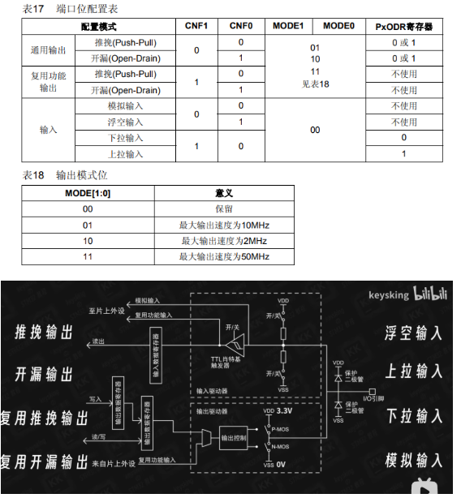
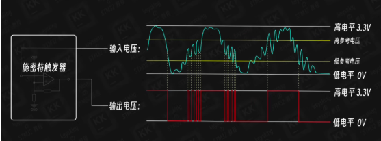
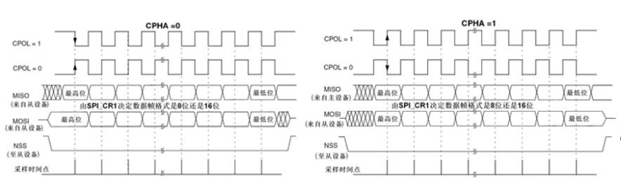
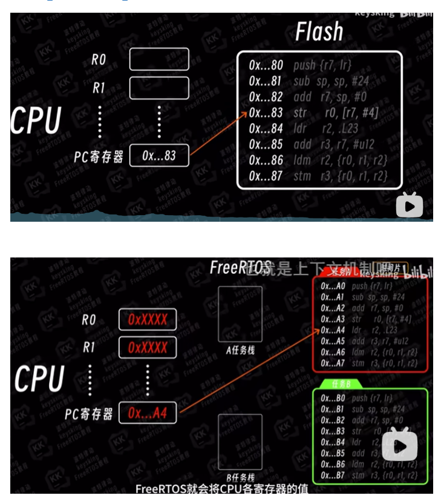
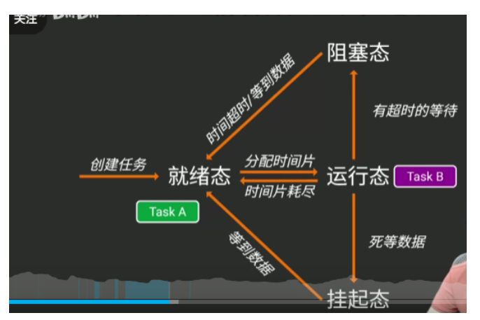

嵌入式开发面试复习2.26

> 涵盖 C 语言基础、STM32 单片机、FreeRTOS 实时操作系统及项目实战经验

---

## 目录

1. [C 语言基础](#一c-语言基础)
2. [STM32 单片机](#二stm32-单片机)
3. [FreeRTOS 实时操作系统](#三freertos-实时操作系统)
4. [Linux 基础](#四linux-基础)
5. [项目开发流程](#五项目开发流程)
6. [项目实战](#六项目实战)
   - 6.1 [小智 AI 语音聊天机器人](#61-小智-ai-语音聊天机器人)
   - 6.2 [智能门铃](#62-智能门铃)
   - 6.3 [智能门锁](#63-智能门锁)
   - 6.4 [无人机飞控](#64-无人机飞控)
   - 6.5 [牛羊定位器](#65-牛羊定位器)
   - 6.6 [STM32 网关](#66-stm32-网关)
   - 6.7 [步进电机控制](#67-步进电机控制)

---

## 一、C 语言基础

### 1.1 源码到可执行文件的过程

| 阶段 | 功能 | 输出 |
|------|------|------|
| **预处理** | 执行预处理指令、去掉空格注释、宏替换 | 预处理后的源码 `.i` |
| **编译** | 预处理后的源文件 → 汇编文件 | `.s` 汇编文件 |
| **汇编** | 汇编文件 → 二进制目标文件 | `.o` 目标文件 |
| **链接** | 多个目标文件和库文件链接成可执行文件 | 可执行二进制文件 |

### 1.2 C 语言内存模型

```
高地址
+------------------+
|      栈区        |  ← 局部变量、函数参数（向下增长）
+------------------+
|      堆区        |  ← 动态分配内存（malloc/free，向上增长）
+------------------+
|    全局静态区     |  ← 全局变量、静态局部变量、字符串常量
|   (数据区)       |      - 未初始化区（BSS）
|                  |      - 初始化区
+------------------+
|   文本段(代码段)  |  ← 函数体的二进制指令
+------------------+
低地址
```

#### 堆和栈的区别

| 特性 | 堆 | 栈 |
|------|------|------|
| **申请方式** | 程序员手动申请（malloc/calloc） | 编译器自动分配 |
| **生长方向** | 从低地址向高地址增长（↑） | 从高地址向低地址增长（↓） |
| **效率** | 较慢（需要查找空闲块） | 较快（直接移动指针） |
| **碎片问题** | 容易产生碎片 | 无碎片 |
| **面向对象** | 面向用户 | 面向操作系统 |
| **生命周期** | 由程序员控制 | 由函数控制 |
| **大小限制** | 较大（受限于虚拟内存） | 较小（默认几MB） |

#### 如何避免堆栈溢出？

- 及时 `free` 释放内存
- 递归层次不要过深
- 传参尽可能传指针，不要传递过大的对象

### 1.3 32/64 位系统的地址长度

- **32 位系统**：地址长度 4 字节
- **64 位系统**：地址长度 8 字节

### 1.4 变量的声明与定义

```c
// 声明：告诉编译器变量的类型和名称
int a;

// 定义：分配内存并初始化
int a = 10;
```

### 1.5 变量与常量

| 特性 | 变量 | 常量 |
|------|------|------|
| 值的可变性 | 可随时修改 | 只能赋值一次，不可随意修改 |
| 修饰符 | 无 | `const`、`#define` |

变量的值可以修改，常量的值不能修改。

变量通常在运行时分配内容，常量通常在编译时分配内容。


### 1.6 常量定义方式对比

| 特性 | `const` | `#define` |
|------|---------|-----------|
| 引入标准 | C99 | 传统宏定义 |
| 类型检查 | 有，类型安全 | 无，纯文本替换 |
| 作用域 | 有作用域 | 无作用域 |
| 内存分配 | 可能分配内存 | 不分配内存 |
| 调试 | 方便 | 困难 |

> **习惯用法**：`#define` 更常用，方便全局宏替换

### 1.7 全局变量与局部变量

| 特性 | 全局变量 | 局部变量 |
|------|----------|----------|
| **作用域** | 整个程序 | 声明它的代码块内（当前函数） |
| **定义位置** | 函数外部 | 函数内部 |
| **生命周期** | 整个程序运行期间 | 函数执行期间 |
| **存储位置** | 全局静态区 | 栈 |
| **默认初始化** | 自动初始化为 0 | 随机值（脏数据） |

### 1.8 预处理指令

```c
#include    // 包含头文件
#define     // 宏定义
#if / #ifdef / #ifndef / #endif   // 条件编译
#undef      // 取消宏定义
#if	//如果表达式为真
#ifdef	//如果宏已定义
#ifndef	//如果宏未定义
#else	//否则
#elif	//否则如果
#endif	//结束条件编译
```

| 指令       | 含义             | 示例               |
| ---------- | ---------------- | ------------------ |
| `#include` | 包含头文件       | `#include `        |
| `#define`  | 定义宏           | `#define PI 3.14`  |
| `#undef`   | 取消宏定义       | `#undef PI`        |
| `#ifdef`   | 如果宏**已定义** | `#ifdef DEBUG`     |
| `#ifndef`  | 如果宏**未定义** | `#ifndef DEBUG`    |
| `#if`      | 条件判断         | `#if LEVEL > 1`    |
| `#else`    | 否则             | `#else`            |
| `#elif`    | 否则如果         | `#elif LEVEL == 2` |
| `#endif`   | 结束条件块       | `#endif`           |


### 1.9 条件编译的应用场景

1. **调试代码**：通过宏开关控制调试信息输出
   
    发布版本只需注释 `#define DEBUG`，所有调试代码都不会编译进去，不占用程序空间。 
   
   ```c
   #define DEBUG
   #ifdef DEBUG
    printf("debug info\n");
   #endif
   ```
   
2. **功能开关**：选择性编译某些功能模块（如 FreeRTOSConfig.h）

3. **跨平台编译**：针对不同平台(win/linux)编译不同代码

### 1.10 数据类型

#### 内置类型

| 类型 | 说明 |
|------|------|
| `char` | 字符型（8位整数，ASCII码）   1 |
| `short` | 短整型   2 |
| `int` | 整型    4 |
| `long` | 长整型（armcc 编译器下 4 字节）  4 |
| `long long` | 长长整型（C99）   8 |
| `float` | 单精度浮点   4 |
| `double` | 双精度浮点    8 |
| `unsigned xxx` | 无符号版本 |

char 本质 长度为1个字节的整数，实际存储的是字符对应的ascii的编码值


#### 自定义类型

- **结构体**（`struct`）：封装多个不同类型的数据
- **共用体**（`union`）：所有成员共享同一块内存
- **枚举**（`enum`）：定义具名常量集合（代码阅读性更好，类型更安全）

### 1.11 整型和浮点型存储原理

#### 整型存储（补码形式）

```
正数 8：0000 1000
负数 -8：
    原码：1000 1000
    反码：1111 0111
    补码：1111 1000（反码 + 1）
```

> **优势**：节省底层硬件电路，使用加法电路实现减法

#### 浮点型存储

```
符号位(1位) + 指数位(8位float/11位double) + 尾数位

符号位：1表示负数，0表示正数
指数位：科学计数法中的指数（偏移量存储）
尾数位：只存储小数点后的值
```

### 1.12 自动类型转换原则

#### 整数转换

- 窄类型 → 宽类型
- 有符号 → 无符号

#### 浮点数转换
- `float` → `double`

#### 整数与浮点数
- 整数 → 浮点数

### 1.13 num++ vs ++num

```c
int i = 1;

// i++：先取值，后自增
int a = i++;  // a = 1, i = 2

// ++i：先自增，后取值
int b = ++i;  // i = 3, b = 3

// 经典面试题
printf("%d %d", i++, i++);  // 结果取决于编译器实现（未定义行为）
```

| 表达式 | 说明 |
|--------|------|
| `i++` | 后置自增：先返回原值，再自增 |
| `++i` | 前置自增：先自增，再返回新值 |

### 1.14 `typedef` vs `#define`

| 特性 | `typedef` | `#define` |
|------|-----------|-----------|
| 本质 | 关键字，创建真正的类型别名 | 预处理器文本替换 |
| 类型检查 | 有 | 无 |
| 作用域 | 有 | 无 |
| 安全性 | 更安全 | 缺乏安全性 |

### 1.14 控制语句

#### switch 语句

```c
switch (整型变量) {  // 只能是整数类型或枚举
    case 1: ...; break;
    case 2: ...; break;
    default: ...;
}
```

#### break 与 continue

| 语句 | 循环中作用 | switch 中作用 |
|------|-----------|---------------|
| `break` | 结束最内层循环 | 防止 case 穿透 |
| `continue` | 结束本轮循环，进入下一轮 | 不适用 |

### 1.15 数组

#### 特点

- 内存连续存储（不连续的是链表）
- 长度固定（定义时确定）
- 通过下标或指针访问

#### 数组长度计算

```c
int arr[10];
int length = sizeof(arr) / sizeof(arr[0]);  // 40/4 = 10
sizeof(arr) 是是数组总字节数
length 算出来是元素个数
```

#### 多维数组

```c
int arr[2][3];  // 数组的元素还是数组

// C语言中多维数组在内存中是连续存储的
// arr[2][3] 内存布局：
// arr[0][0] arr[0][1] arr[0][2] arr[1][0] arr[1][1] arr[1][2]
```

### 1.16 字符串

- **本质**：以 `'\0'` 结尾的字符数组

#### `sizeof` vs `strlen`

| 函数 | 计算内容 | 是否包含 `'\0'` |
|------|----------|-----------------|
| `sizeof` | 数组总大小（字节） | 包含 |
| `strlen` | 字符串实际长度 | 不包含 |

### 1.17 指针

#### 指针运算

| 运算 | 说明 | 结果 |
|------|------|------|
| 指针 - 指针 | 计算两个指针间的元素距离（元素个数） | 整数（元素个数） |
| 指针 + 指针 | **没有意义** | - |
| 指针 ± 整数 | 指针移动 | 新地址 |
| 指针比较 | 比较地址值 | 布尔值 |

> **注意**：指针相加没有实际意义，只有相减才能计算元素距离。

#### 指针与数组名的区别

- **数组名**：常量指针，不可修改，代表数组首地址
- **指针变量**：可以修改指向

#### 指针数组 vs 数组指针

```c
int *p[10];    // 指针数组：数组，存储 10 个 int* 指针
int (*p)[10];  // 数组指针：指针，指向一个包含 10 个 int 的数组
```

#### 指针函数 vs 函数指针

```c
int *func(int a, int b);   // 指针函数：返回 int* 的函数  返回值是指针的函数(注意不能返回局部变量地址)
int (*func)(int a, int b); // 函数指针：指向函数的指针
```

#### 常量指针 vs 指针常量

```c
const int *p;    ( 定义指针，const)
				// 常量指针：指向常量的指针   不能修改指向的值(常量)
                // *p = 10;  // 错误：不能修改指向的值 
                // p = &a;   // 正确：可以修改指向

int *const p;  (定义一个常量为指针)
				// 指针常量：指针本身是常量  不能修改指向的地址(可以改指向地址的值)
                // *p = 10;  // 正确：可以修改指向的值
                // p = &a;   // 错误：不能修改指向
```

#### 特殊指针

| 类型 | 定义 | 危害 |
|------|------|------|
| **空指针** | `NULL`（地址 0）指向无效地址 | 访问会崩溃（可控） |
| **悬空指针** | 指向已释放内存的指针(内存已释放，但指针还保留原地址) | 不可预测的行为**不可预测**，可能崩溃、可能读到垃圾值、可能正常 |
| **野指针** | 未初始化的指针.未初始化，指向未知内存 | 不可预测的行为 |

```c
// 悬空指针示例
int *a = malloc(100);
free(a);  // a 变成悬空指针
// 正确做法：free(a) 后 a = NULL;
```

#### 指针和引用的区别（C++）

```c
int a = 3;
int &ra = a;  // 引用是变量的别名

// 区别：
// 1. 指针可以不初始化，引用必须初始化（唯一绑定不可更改）
// 2. 操作引用就是直接操作值，引用直接和内存的值绑定
```

### 1.18 结构体与共用体

#### 访问方式

```c
struct Person p;
struct Person *ptr = &p;

p.name;      // 结构体变量访问成员
ptr->name;   // 结构体指针访问成员
```

#### 内存对齐

1. **结构体本身对齐**：地址是最大成员长度的倍数
2. **成员对齐**：每个成员按自身大小对齐（合理节省内存占用）

```c
// 示例
struct {
    char a;   // 1字节 + 3字节填充
    int b;    // 4字节
    short c;  // 2字节 + 2字节填充
};  // 总大小：12字节
```

#### 函数中传入结构体还是结构体指针？

| 方式 | 栈空间 | 修改外部 |
|------|--------|----------|
| 传值 | 变大 | 不影响 |
| 传指针 | 较小 | 会影响 |

> **建议**：一般使用结构体指针，栈占用空间少

#### 结构体 vs 共用体

| 特性 | 结构体（`struct`） | 共用体（`union`） |
|------|-------------------|-------------------|
| 内存分配 | 每个成员独立内存 | 所有成员共享同一块内存 |
| 大小 | 所有成员大小之和（考虑对齐） | 最大成员的大小 |
| 用途 | 封装相关数据 | 节省内存，多态场景 |

### 1.19 函数

#### 形参与实参

| 概念 | 说明 |
|------|------|
| **形参** | 函数声明/定义时的参数 |
| **实参** | 函数调用时传入的参数 |

#### 主函数参数

```c
int main(int argc, char *argv[]) {
    // argc: 参数个数（包含程序名）
    // argv: 参数数组
    // 示例：./hello a b c
    // argc = 4, argv = ["hello", "a", "b", "c"]
    return 0;  // 返回值表示程序退出状态
}
```

主函数可以不带任何参数。这是最常见的形式。

可以设置两个形参：argc（argument count）和argv（argument vector）。这主要用于处理命令行参数。

（1）argc：参数的数量。它至少为1，因为第一个参数是程序的名称。

（2）argv：一个由字符指针组成的指针数组，每个指针指向一个命令行参数的字符串。

返回值0表示运行成功，其它非零整数表示运行失败。

#### 函数原型

只有签名，没有实现的函数声明：

```c
void func(int a, int b);  // 函数原型
```

#### 传递方式对比

| 方式 | 特点 | 适用场景 |
|------|------|----------|
| **传值** | 复制数据，函数内修改不影响外部 | 小数据量 |
| **传指针** | 传递地址，可修改原数据 | 大数据、需要修改原数据 |

#### 回调函数

函数指针作为参数，实现函数的动态调用。

```c
// 定义函数指针类型
typedef void (*CallbackFunc)(int);

// 注册回调函数
void registerCallback(CallbackFunc cb);

// 应用场景：MQTT客户端回调、蓝牙回调
```

#### 带参宏 vs 函数

| 特性 | 带参宏 | 函数 |
|------|--------|------|
| 执行时机 | 编译时文本替换 | 运行时调用 |
| 类型检查 | 无 | 有 |
| 调试 | 困难 | 容易 |
| 代码体积 | 可能膨胀 | 固定 |

#### 内联函数（`inline`）

```c
inline void func() {
    // 一行或几行简单代码
    // 建议编译器将函数体直接插入调用处，减少调用开销
}
```

#### 常用输出函数

| 函数 | 功能 | 示例 |
|------|------|------|
| `printf` | 标准输出（控制台） | `printf("%d", a)` |
| `sprintf` | 输出到字符串 | `sprintf(buf, "%d", a)` |
| `fprintf` | 输出到文件 | `fprintf(file, "%d", a)` |

#### 常用内存函数

| 函数 | 功能 |
|------|------|
| `malloc` | 动态分配内存（不初始化） |
| `calloc` | 动态分配内存（初始化为0） |
| `realloc` | 重新分配内存大小 |
| `free` | 释放内存 |
| `memset` | 设置内存值 |
| `memcpy` | 内存拷贝 |
| `memmove` | 内存移动（支持重叠） |

#### malloc vs calloc

```c
// malloc: 分配指定字节数，内容未初始化（垃圾值）
void *malloc(size_t size);
int *p1 = malloc(10 * sizeof(int));  // 分配 40 字节

// calloc: 分配并初始化为 0
void *calloc(size_t num, size_t size);
int *p2 = calloc(10, sizeof(int));   // 分配 40 字节，全部初始化为 0
```

| 特性 | malloc | calloc |
|------|--------|--------|
| **参数** | 单个参数（总字节数） | 两个参数（元素个数 + 每个元素大小） |
| **初始化** | 不初始化，内容是垃圾值 | 自动初始化为 0 |
| **效率** | 稍快（不做初始化） | 稍慢（需要清零） |
| **适用场景** | 即将覆盖写入的数据 | 需要零初始化的数组、结构体 |

**等价关系**：
```c
// calloc(n, size) 等价于:
malloc(n * size) + memset(ptr, 0, n * size)
```

### 1.20 关键字

#### `static`

| 用法 | 作用 |
|------|------|
| **全局变量/函数** | 限制作用域在当前文件（内部链接） |
| **局部变量** | 生命周期延长到整个程序运行期间，只初始化一次，存储在全局静态区 |

#### `extern`

声明外部变量，表示变量在其他文件中定义。

```c
extern int globalVar;  // 声明外部变量
```

#### `volatile`

防止编译器优化，强制每次从内存读取变量值。

```c
volatile int flag;  // 可能用于多线程或硬件寄存器
// 嵌入式中常见：__IO, __I, __O
```

**原理**：CPU每次读取都去内存读取访问最新值，而不是从寄存器缓存读取。

### 1.21 内存相关

#### 虚拟内存

> **问题**：1G 物理内存能否 `malloc(1.2G)`？
> 
> **答案**：能。通过虚拟内存机制（MMU），操作系统可以提供比物理内存更大的地址空间。将暂时不运行的进程 swap 到磁盘中。

#### 内存泄漏

```c
// 错误示例1：指针覆盖
int *a = malloc(100);
a = malloc(200);  // 第一次分配的 100 字节丢失，无法释放

// 错误示例2：指针置空后无法释放
int *a = malloc(100);
a = NULL;  // 原内存地址丢失，造成泄漏
// free(a);  // 无效，无法释放原内存
```

**预防措施**：
- 及时 `free` 释放不再使用的内存
- `free` 后立即将指针置为 `NULL`
- 使用内存检测工具（如 Valgrind）

#### 内存溢出（OOM）

直接报错，系统内存不足。当申请的内存超过系统可用内存时发生。

---

## 二、STM32 单片机

### 2.1 指令集架构

| 类型 | 代表 | 特点 |
|------|------|------|
| **CISC（复杂指令集）** | x86 | 指令多、变长、复杂 |
| **RISC（精简指令集）** | ARM、RISC-V | 指令少、定长、简单 |

### 2.2 CPU 架构组成

| 组成部分 | 功能 |
|----------|------|
| **CU（控制单元）** | 将指令转化为控制电信号，控制寄存器和ALU加载计算 |
| **ALU（算术逻辑单元）** | 逻辑运算单元 |
| **MMU（内存管理单元）** | 虚拟内存映射 |
| **寄存器** | 通用寄存器、状态寄存器、程序计数器 |

### 2.3 ARM 处理器分类

| 系列 | 特点 | 应用场景 |
|------|------|----------|
| **A 系列** | 高性能 | 手机、平板、电视、机器人、医疗、车载 |
| **R 系列** | 实时性 | 汽车、医疗、车载 |
| **M 系列** | 嵌入式 | 传感器、智能家居 |

### 2.4 存储器类型

| 类型 | 全称 | 特点 |
|------|------|------|
| **ROM** | Read-Only Memory(flash ) | 只读，掉电不丢失（磁盘） |
| **RAM** | Random Access Memory | 随机读写，掉电丢失（内存） |
| **Register** | 寄存器 | CPU 内部，速度最快 |

#### 特点对比

容量：Register < RAM < ROM  
效率：Register > RAM > ROM  
价格：Register > RAM > ROM		

#### SRAM vs DRAM vs SDRAM

| 类型 | 特点 |
|------|------|
| **SRAM** | 静态 RAM，速度快，无需刷新，贵，用于 CPU L级缓存 |
| **DRAM** | 动态 RAM，需周期性刷新，便宜，用于内存条 |
| **SDRAM** | 同步 DRAM，与系统时钟同步，效率比 DRAM 稍高 |

| 存储器       | 存放内容       | 掉电   | 读写速度 |
| ------------ | -------------- | ------ | -------- |
| **Flash**    | 程序代码、常量 | 不丢失 | 较慢     |
| **RAM/SRAM** | 变量、堆栈     | 丢失   | 很快     |
| **EEPROM**   | 用户数据       | 不丢失 | 慢       |

 Flash 确实慢，但通过预取、缓存等技术，实际执行效率已经足够高。 

```
┌─────────────────────────┐
│   ARM Cortex-M3 内核     │  ← CPU核心
├─────────────────────────┤
│       总线矩阵           │  ← 数据交换中心
├─────────────────────────┤
│   Flash  │  外设  │ SRAM │  ← 存储/外设
├──────────┴──────────────┤
│  GPIO │ USART │ IIC ... │  ← 具体外设
├─────────────────────────┤
│      STM32F10X 芯片      │
└─────────────────────────┘

Flash → 硬盘（程序存储）
SRAM  → 内存条（数据存储）

```


### 2.5 字节序（Endianness）

#### 定义

多字节数据在内存中的存储顺序。

```c
int a = 1;  // 0x00000001

// 小端序（Little Endian）：低地址存低位
// 内存：00 00 00 01（低地址 → 高地址）

// 大端序（Big Endian）：低地址存高位
// 内存：01 00 00 00（低地址 → 高地址）
```

#### 常见架构

| 架构 | 字节序 |
|------|--------|
| x86 | 小端序 |
| ARM | 小端序（可配置） |

```
*(char *)&a ==1
```


#### 判断字节序的方法 判断大小端

**方法 1：指针法** 取第一个字节判断

```c
int a = 1;   //0x00000001
if (*(char *)&a == 1)
    printf("小端序\n");
else
    printf("大端序\n");
// 小端序内存布局（低地址 → 高地址）:
// 地址: 0x1000  0x1001  0x1002  0x1003
// 数据:   01      00      00      00

// 大端序内存布局（低地址 → 高地址）:
// 地址: 0x1000  0x1001  0x1002  0x1003
// 数据:   00      00      00      01
*(char *)&a
│    │   │
│    │   └── int a 的地址（指向4字节）
│    └────── 强制转为 char*（只取1字节）
└─────────── 解引用，读取第一个字节
    
字节序	第一个字节	结果
小端序	0x01	== 1 ✓
大端序	0x00	!= 1
```

**方法 2：共用体法**

```c
//共享内存 访问低字节
union {
    int a;
    char b;
} c;
c.a = 1;
if (c.b == 1)
    printf("小端序\n");
else
    printf("大端序\n");
 	// 0x00 00 00 01
    // union使用同一块内存，char从最低地址开始
```

### 2.6 最小系统

STM32单片机能工作的最小外围电路就叫最小系统。

STM32 最小系统组成： 

1. **芯片**
2. **晶振**（外部高速/低速晶振）
3. **电源**电路
4. **复位**电路
5. **下载**电路（SWD/JTAG）

> 定义：能让单片机运行起来的最小外围电路

STM32的外设有哪些

I2C、SPI、ADC、UART、CAN、TIM、独立看门狗（IWDG）、RTC。

### 2.7 复位后 main 函数执行前的操作

1. **复位向量**：程序计数器（PC）跳转到复位向量地址（存在中断向量表）  	 读取向量表，设置 SP 和 PC  
2. **执行启动代码**：汇编写的启动文件，负责基本硬件初始化
3. **堆栈指针初始化**
4. **系统时钟初始化**
5. **数据段初始化**
6. **C库初始化**：初始化C库所需的内部数据结构
7. **执行 main 函数**  执行用户代码

### 2.8 中断

#### 概念

CPU 对系统发生某事件时的一种响应机制 

, 处理突发事件，提高效率实时性

CPU 暂停正在执行的程序，在保留现场后，自动地转去执行该事件的中断处理程序，执行完后，再返回到原程序的断点处继续执行。

#### **简述一下STM32中断有哪些？**

外部中断、定时器中断、DMA中断、UART中断、SPI中断、I2C中断、USB中断、ADC中断。

#### 中断向量

中断处理程序入口地址。

#### 中断向量表

存放中断码(中断标识IRQ)、中断处理程序(ISR)入口地址的一段内存空间

存储各个中断服务程序入口地址的一段内存（指针数组，存储不同中断的函数指针）。、

  存放中断服务函数入口地址的一张"地址表"

#### 中断处理过程

```
中断事件发生，响应中断 → 保存现场 → 执行中断服务程序 → 恢复现场 → 中断返回
```

```
1. 中断发生，响应中断（外部信号/定时器/串口等）
         ↓
2. 完成当前指令（保护现场起点）
         ↓
3. 硬件自动执行：
   - 保存现场（寄存器压栈）
   - 查中断向量表获取 ISR 地址
   - 更新 PC 指向 ISR
         ↓
4. 执行中断服务函数（ISR）
   - 处理紧急事件
   - 清除中断标志（重要！）
         ↓
5. 检查是否有更高优先级中断 pending
   - 有：发生中断嵌套（转步骤3）
   - 无：继续
         ↓
6. 恢复现场（寄存器出栈）
         ↓
7. 返回主程序继续执行
```

#### 中断嵌套

高优先级中断可以打断低优先级中断的执行。

#### 中断服务函数特点

| 特性 | 说明 |
|------|------|
| 参数 | 无 |
| 返回值 | 无 |
| 命名 | 固定（与向量表对应） |
| 递归 | 不可递归 |
| 耗时操作 | 应避免 |
| 调用方式 | 硬件自动调用 |
|  | 需要配置相应的寄存器来开启中断 |

#### 中断服务函数优化（执行时间过长）

 推迟执行

**问题**：执行时间过长会阻塞系统。

**解决方案**：

| 场景 | 方法 |
|------|------|
| **裸机** | 中断设置标志位，主循环轮询处理 |
| **RTOS** | 中断发送使用信号量、队列、任务通知等手段实现ISR与Task之间的同步。 |

**中断推迟处理实现**：

- 裸机：中断修改标志位，main函数轮询标志位
- FreeRTOS：使用信号量、队列、任务通知等手段实现ISR与Task之间的同步。

#### 中断优先级分组

支持多种分组方式（3、4、5、6、7 位用于抢占优先级）。

分为组0~5，组号表示抢占优先级可设置的位数，抢占 + 响应 = 4位。

```
抢占优先级（Goup）： 优先级高的会打断优先级低
响应优先级（Sub）：不会打断优先级低，排队等待
```

响应优先级决定能否打断别人，响应优先级决定响应顺序

优先级值越小，优先级越高。
⮚ 如果不设置优先级，则默认优先级为0。
⮚ 先比较抢占优先级。抢占优先级高的 可以打断抢占优先级低的。
⮚ 若抢占优先级一样，再比较响应优先级。但是响应优先级不会导致中断嵌套。
⮚ 若抢占优先级一样的同时挂起，则优先处理响应抢占优先级高的。
⮚ 若挂起的优先级（抢占和响应）都一样，则查找中断向量表，值小的先响应。

|               | ***\*抢占优先级\**** | ***\*响应优先级\**** |
| ------------- | -------------------- | -------------------- |
| ***\*组0\**** | 0位（0）             | 4位                  |
| ***\*组1\**** | 1位（0~1）           | 3位                  |
| ***\*组2\**** | 2位（0~3）           | 2位                  |
| ***\*组3\**** | 3位（0~7）           | 1位                  |
| ***\*组4\**** | 4位（0~15）          | 0位                  |

**相比于正常函数，中断服务函数有什么特点和需要注意的地方？** 

对于中断服务函数：

（1）没有参数和返回值。

（2）需要配置相应的寄存器来开启中断。

（3）触发条件满足时，硬件自动调用。

（4）内部不能递归调用自己。

（5）尽量不要执行耗时操作。

### 2.9 GPIO  **General Purpose Input/Output（通用输入输出）** 

GPIO是通用输入输出，STM32的一种重要的外设，可以用于控制数字输入输出

```
功能：
├── 输入：读取外部信号（按键、传感器）
├── 输出：控制外部设备（LED、继电器）
└── 复用：作为其他外设引脚（USART、SPI、I2C）
```



#### 8 种工作模式

| 类型 | 模式 | 说明 |
|------|------|------|
| **输入** | 模拟输入 | ADC 采集 |
| | 浮空输入 | 高阻态，电平不确定 |
| | 上拉输入 | 内部上拉电阻 |
| | 下拉输入 | 内部下拉电阻 |
| **输出** | 通用推挽 | 可输出高低电平 |
| | 通用开漏 | 只能输出低电平，高电平需外接上拉 |
| | 复用推挽 | 外设控制，推挽输出 |
| | 复用开漏 | 外设控制，开漏输出 |

复用   **复用推挽是外设硬件控制引脚，用于通信和定时器功能。配置为复用后，GPIO 寄存器失效，由外设接管引脚控制权。** 

#### 推挽 vs 开漏

##### 推挽输出

输出0和1  要么高要么低  没有悬空

**工作原理**：

-  输出高电平（1）：“拉高大力士” (P-MOS)发力，把引脚主动接到 VCC，电流从 VCC→引脚→负载→GND（主动 “拉” 高）；
-  输出低电平（0）：“拉低大力士” (N-MOS)发力，把引脚主动接到 GND，电流从负载→引脚→GND（主动 “推” 低）；

##### 开漏输出

 输出0 不能输出1 （上拉电阻输出1 ）

**硬件结构**：内部只有一个 “拉低大力士”（NMOS 管，接 GND），没有 “拉高大力士”（VCC 端是 “断开的”，即 “开漏”）

**工作原理**：

- 输出低电平（0）：“拉低大力士” 发力，把引脚接到 GND（主动 “推” 低）；

- 输出高电平（1）：“拉低大力士” 松手，引脚悬空（不能主动拉到 VCC）—— 必须外接一个 “上拉电阻”（一端接 VCC），靠电阻把引脚 “被动拉高” 到 VCC；

  只能主动输出低电平，高电平靠外部上拉电阻实现 

  开漏可以读取外部数据 

   低电平上  推挽开漏一致，

| 特性             | 推挽输出 (Push-Pull)          | 开漏输出 (Open-Drain)                   |
| ---------------- | ----------------------------- | --------------------------------------- |
| **高电平输出**   | 直接输出                      | 需外接上拉电阻                          |
| **低电平输出**   | 直接输出                      | 直接输出                                |
| **主动输出能力** | 高、低都能主动输出            | 只能主动输出低，高靠外部上拉            |
| **驱动能力**     | 强（管子直接驱动，电流大）    | 弱（高电平靠电阻，电流受限制）          |
| **外部元件需求** | 无需额外电阻                  | 必须接上拉电阻（否则高电平无效）        |
| **线与功能**     | ❌ 不支持                      | ✅ 支持（核心优势，如 I2C 总线）         |
| **多设备并联**   | ❌ 不支持（会短路 VCC 和 GND） | ✅ 支持                                  |
| **电平匹配**     | 固定 VCC 电平（如 3.3V）      | 灵活（上拉接 5V 可输出 5V，跨电平通信） |
| **短路风险**     | ⚠️ 有                          | ✅ 无                                    |
| **常见别名**     | PP 输出                       | OD 输出、集电极开路（OC）               |
| **典型应用**     | LED、蜂鸣器驱动               | I2C、SMBus、One-Wire 总线               |

#### **STM32 IO口开漏输出和推挽输出有什么区别？**

（1）推挽输出既能输出低电平也能输出高电平，有比较强的电流驱动能力。

（2）开漏输出只能输出低电平，不能输出高电平。如果要输出高电平，需要外部接入上拉电阻。

需要读引脚电平 选开漏   

不需要 选推挽 

要强驱动、稳定电平、单向输出 （如 LED、SPI）→ 用推挽；

 **要多设备共享总线、跨电平通信、线与逻辑（如 I2C、中断并联）→ 用开漏（记得接外部上拉电阻）**




- 外部信号是「低电平触发」且可能悬空 → 上拉输入（默认高，拉低有效）；
- 外部信号是「高电平触发」且可能悬空 → 下拉输入（默认低，拉高有效）；
- 外部信号「稳定且高速」（如串口、SPI） → 浮空输入（无电阻，快响应）。

| 输入模式     | 默认电平（悬空时） | 电阻配置                 | 稳定性 | 响应速度 | 核心适用场景                                          |
| ------------ | ------------------ | ------------------------ | ------ | -------- | ----------------------------------------------------- |
| **上拉输入** | 高电平 (1)         | 内部/外部电阻接 VCC      | 高     | 中等     | 按键检测、低电平触发的传感器                          |
| **下拉输入** | 低电平 (0)         | 内部/外部电阻接 GND      | 高     | 中等     | 高电平触发的传感器、避免高电平干扰                    |
| **浮空输入** | 不确定（乱跳）     | 无任何上拉/下拉电阻      | 低     | 快       | 高速信号接收（UART RX、SPI MISO）、外部信号稳定的场景 |
| **模拟输入** | -                  | 无数字电阻，直连模拟通道 | -      | -        | ADC 采集、模拟传感器、电池电压检测                    |


### 2.10 I2C 通信

**谈一下I2C总线**:

 I2C 是一种**串行、半双工、同步**的通信协议，用于板内芯片间低速通信。 

 I2C 适合**板内近距离、多设备、低速率**的场景，如传感器、EEPROM、RTC 等，是嵌入式中最常用的总线之一。 

#### 基本概念

- **用途**：板内芯片间低速通信
- **特点**：同步、半双工、串行
- **速度**：100KHz（标准）、400KHz（快速）、3.4MHz（高速）

#### 硬件连接

| 信号线  | 功能   | 特点                   |
| ------- | ------ | ---------------------- |
| **SCL** | 时钟线 | 主机产生，同步数据传输 |
| **SDA** | 数据线 | 双向传输，半双工       |

**关键特点**：

- **开漏输出**：必须外接上拉电阻（通常 4.7kΩ）
- **线与功能**：支持多主设备仲裁
- **速度**：标准 100kHz、快速 400kHz、高速 3.4MHz

#### 主从架构

- 一主多从
- 每个从机有唯一的 7 位/10 位设备地址  一位读写标志位
- 传输协议：每次通信，都要一个起始信号开始，以终止信号结束，中间的数据以字节为单位进行发送，每发送一个字节，都要接受一个确认信号

#### 协议信号

空闲状态：SCL和SDA均为高电平，接上拉电阻

启动信号：SCL保持高电平，SDA由高变低

数据位传送：SCL保持高电平，SDA保持稳定（低电平数据0，高电平数据1）

ACK应答信号：SCL保持高电平，SDA保持低电平

NACK非应答信号：SCL保持高电平，SDA保持高电平

停止信号：SCL保持高电平，SDA变高


```
时钟线SCL
    ─┐  ┌─┐  ┌─┐  ┌─┐  ┌─┐  ┌─┐  ┌─┐  ┌─┐  ┌─┐  ┌─┐  ┌─┐  ┌─┐  ┌─┐  ┌─┐  ┌─┐  ┌─┐  ┌──
     └──┘  └──┘  └──┘  └──┘  └──┘  └──┘  └──┘  └──┘  └──┘  └──┘  └──┘  └──┘  └──┘  └──┘  └──┘  └──┘
      ↑    ↑    ↑    ↑    ↑    ↑    ↑    ↑    ↑    ↑    ↑    ↑    ↑    ↑    ↑    ↑    ↑
     S   A6   A5   A4   A3   A2   A1   A0   R/W  ACK  D7   D6   D5   D4   D3   D2   D1   D0   ACK   P
    起始  设备地址(7位)        读/写  应答  数据(8位)                              应答  停止

数据线SDA
    ──┐        ┌────┐     ┌────┐  ┌──┐        ┌──┐  ┌────┐     ┌────────┐  ┌────┐
      └────────┘    └────┘     └──┘  └────────┘  └──┘     └────┘        └──┘    └────┘
      ↓        ↓    ↓    ↓    ↓    ↓    ↓    ↓    ↓    ↓    ↓    ↓    ↓    ↓    ↓    ↓
     SCL高    SCL低电平准备数据，SCL高电平采样
     SDA下降
     =Start

```


#### 写寄存器时序

```
Start → 发送设备写地址(0) → 等待 ACK → 发送寄存器地址 → 等待 ACK 
      → 发送数据 → 等待 ACK → Stop
```

#### I2C 使用开漏模式的原因

1. **防止短路**：多个设备共用总线时避免冲突   

   ​					,多个从机，一个拉高，一个拉低，就会短路。开漏输出有上拉电阻限流。

2. **实现线与功能**：实现线与功能，支持多主仲裁

    开漏的线与特性让硬件自动完成仲裁，无需额外电路 

 **线与逻辑**：  只要有一个设备输出低，总线就是低；**所有设备都释放（高阻），总线才是高**。 

```
        VCC
         │
        ┌┴┐
        │ │ 上拉电阻
        └┬┘
         ├──────────── 总线电平
    ┌────┼────┐
    │    │    │
   设备A 设备B 设备C
   (开漏) (开漏) (开漏)
    │    │    │
    └────┴────┘
         │
        GND

```

#### 多主仲裁（Multi-Master Arbitration）

```
时钟:  1   2   3   4   5   6   7   8
      ┌─┐ ┌─┐ ┌─┐ ┌─┐ ┌─┐ ┌─┐ ┌─┐ ┌─┐
SCL:  │ │ │ │ │ │ │ │ │ │ │ │ │ │ │ │
      └─┘ └─┘ └─┘ └─┘ └─┘ └─┘ └─┘ └─┘

SDA:
主机A:  0   1   0   1   0   1   0   1   (想发0x55)
主机B:  0   1   0   1   0   0   0   1   (想发0x51)
        ↓   ↓   ↓   ↓   ↓   ↓   ↓   ↓
总线:   0   1   0   1   0   0   0   1   (线与结果)
        ↑   ↑   ↑   ↑   ↑   ↑   ↑   ↑
主机A读:0   1   0   1   0   0←─不一样！A发现冲突，主动退出
主机B读:0   1   0   1   0   0   0   1   B继续发送

```

| 步骤 | 动作                                 | 结果                           |
| :--: | ------------------------------------ | ------------------------------ |
|  1   | 每个主机发送数据时，同时监听总线     | 检查是否与自己想发的相同       |
|  2   | 如果发现不一致（自己想发1，但读到0） | **立即退出仲裁**，转为从机模式 |
|  3   | 最后剩下的主机                       | 赢得总线控制权，继续传输       |

| 概念         | 核心机制                              | 作用                             |
| ------------ | ------------------------------------- | -------------------------------- |
| **线与功能** | 开漏输出 + 上拉电阻，"有0则0，全1才1" | 防止短路，支持多设备共用总线     |
| **多主仲裁** | 发送时监听，冲突自动退出              | 多个主机可以共存，自动协调通信权 |

 线与功能让 I2C 总线可以"线与"，多主仲裁让主机们"公平竞争"，冲突时低位优先（谁先发0谁赢 

#### 驱动验证方法

- 读从机ID或者先写一个寄存器然后读取对比结果是否一样。
- 使用逻辑分析仪查看波形和协议是否一致 

#### IIC通讯接一个多大的电阻，会影响速率吗？

一般1-10k，通常4.7k

电阻过小，功耗较大，且容易烧毁I2C接口。

电阻过大，会影响信号的上升沿时间，也就是影响时钟频率，会出现误码。

#### 软件 IIC vs 硬件 IIC

| 特性 | 软件 IIC | 硬件 IIC |
|------|----------|----------|
| 实现方式 | GPIO 模拟 | 硬件外设 |
| CPU 占用 | 较高 | 较低 |
| 可移植性 | 高 | 低 |
| 开发难度 | 繁琐 | 简单 |

#### 上拉电阻选择

- 范围：1-10 千欧，常用 4.7 千欧  4.7kΩ
- 与速率关系：速率越快，电阻越小
- 原则：在不影响数据稳定性的前提下，电阻尽可能大


### 2.11 SPI 通信

**谈一下SPI总线** ：

（1）概念：是一种全双工、同步、串行通信协议

（2）主从模式：一主多从模式

（3）高速：可达到50Mbps。

（4）信号线：SCL、CS（低电平选中）、MOSI、MISO

（5）工作模式：极性和相位的组合



极性CPOL：0，空闲时时钟线低电平；1，空闲高电平。

相位CPHA：0，第一个跳变沿采样；1，第二个跳变沿采样。

模式0：极性和相位都为0，空闲SCL低电平，第一边沿开始采样

模式1：极性0，相位1，空闲SCL低电平，第二边沿开始采样

模式2：极性1，相位0，空闲SCL高电平，第一边沿开始采样

模式3：极性1，相位1，空闲SCL高电平，第二边沿开始采样

#### 硬件连接（4 线）

| 引脚 | 全称 | 功能 |
|------|------|------|
| CS | Chip Select | 片选信号 |
| MOSI | Master Out Slave In | 主出从入 |
| MISO | Master In Slave Out | 主入从出 |
| SCL | Serial Clock | 时钟线 |

#### 主从架构

- 一主多从
- 从设备数量由片选线决定

#### 协议特点

- **本质**：数据交换（发送同时接收）
- **数据格式**：MSB（高位先行）

#### 4 种工作模式

| 模式 | CPOL（极性） | CPHA（相位） | 说明 |
|------|-------------|-------------|------|
| 模式 0 | 0 | 0 | 空闲低电平，第 1 个边沿采样 |
| 模式 1 | 0 | 1 | 空闲低电平，第 2 个边沿采样 |
| 模式 2 | 1 | 0 | 空闲高电平，第 1 个边沿采样 |
| 模式 3 | 1 | 1 | 空闲高电平，第 2 个边沿采样 |

- **CPOL**：空闲时时钟电平（0=低，1=高）
- **CPHA**：采样边沿（0=第 1 个，1=第 2 个）

（1）硬件 SPI是芯片的外设功能，而模拟的SPI是用GPIO实现的。

（2）硬件SPI因为有专用的寄存器支持，所以很少占用CPU资源。

（3）软件模拟SPI适合于引脚不够用时，用普通GPIO即可实现，通用性强，移植方便。


### 2.12 UART 通信

#### 基本概念

- **特点**：串行、全双工、异步
- **硬件**：Rx、Tx
- 小端序 低位先行

#### 波特率

常用：115200、9600（误差 5% 以内可接受）

#### 数据帧格式

起始位 + 数据位 + 校验位 + 停止位

#### 如何保证接收数据正确？

奇偶校验方式

#### 如何接收不定长数据？

（1）固定格式：收发双方约定好数据开始和结束格式, 比如数据用AB开头，用BA就结束。一旦收到AB表示新数据要来了，一旦收到BA表示数据传输结束。

（2）空闲中断：当串口一段时间没有接收到数据,则会触发空闲中断，可以认为一帧数据已经传输完毕。空闲中断并不是所有的 MCU 都具备，一般高端一点的 MCU 才有，低端一些的 MCU 并没有空闲中断。

我们使用的是STM32芯片，工作中通常使用空闲中断的方式来接收不定长数据。

#### 应用场景

- 调试打印输出（printf 输出重定向）
- 与指纹模组发送 AT 指令
- 与 QS100 模块通信
- RS485 

### 2.13 RS485 vs RS232

**1） RS485

（1）半双工，一对多，两线双绞线（D+、D-），差分传输，抗干扰强，上千米。

（2）一般应用于工厂、楼宇自动化。

**2）RS232

（1）全双工，点对点，三线RXD+TXD+GND，15米。

（2）一般电脑和老式打印机、投影仪。


| 特性           | RS232                | RS485                      |
| -------------- | -------------------- | -------------------------- |
| **传输距离**   | 15 米                | 1200 米                    |
| **信号方式**   | 单端信号（对地电压） | 差分信号（双绞线）         |
| **抗干扰能力** | 弱                   | 强                         |
| **通信模式**   | 全双工、点对点       | 半双工、总线型（一主多从） |
| **设备数量**   | 1 对 1               | 1 主 32 从（最多 128）     |
| **速率**       | 20 kbps              | 10 Mbps                    |
| **电平标准**   | ±3V~±15V             | -2V~-6V(0)、+2V~+6V(1)     |
| **连接器**     | DB9 / DB25           | 端子（2线/4线）            |
| **应用场景**   | 老式打印机、调试串口 | 工业控制、楼宇自动化       |


### 2.14 CAN 总线 vs RS485

| 特性 | CAN 总线 | RS485 |
|------|----------|-------|
| 价格 | 较高 | 较便宜 |
| 抗干扰能力 | 较强（差分信号） | 较弱（差分信号） |
| 应用场景 | 机器人、车载 | 距离较远的场景 |

#### 通信对比

1.1.1.1 **解释一下异步和同步通信的区别**

异步通信：无时钟信号

同步通信：有时钟信号

1.1.1.2 **串行和并行的区别**

串行：数据bit按照顺序前后发送

并行：一次可以发送多个bit

1.1.1.3 **全双工和半双工、单工的区别**

全双工：两台设备可以同时发数据，接受数据

半双工：同一时刻，设备只能收数据或者只能发数据

单工：设备只能发或者只能收


#### CAN通信协议的特点

CAN总线主要应用于车载系统等场景，例如：汽车全身对话，刹车时发动机、ABS、ESP同步响应，它具备：多节点同时通信（支持广播、点对点）、高实时性（传输速率达到1Mbps）、高可靠性（差分信号传输）特点。

1.1.1.2 **CAN总线和485总线的对比?**

**1）*****\*应用场景\****

CAN总线适用设备多、干扰大、要实时抢答、短距离（40米）高速传输（1Mbps），成本较贵（汽车，机器人）。

485适用设备少、距离远（低速下达1200米）、成本便宜适合预算低（工厂，楼宇自动化）。

**2）*****\*硬件电路\****

CAN多主节点，使用CAN_H和CAN_L两根线，通讯采用差分信号，差分电压范围较小，扛干扰能力强。

CAN总线的差分电压范围较小（0V到2V），适合短距离和低噪声环境。

485简单的主从模式，485收发器把单端信号转差分信号，使用两根线A和B，差分电压范围较大，抗干扰能力弱。

RS-485的差分电压范围较大（-5V到+5V），适合长距离和高噪声环境。


| 总线接口 | 串/并 | 同步/异步 | 工作方式 | 速率                        | 线路                      | 距离                     | 设备数               | 硬件复杂度 | 流控制           | 典型应用            |
| -------- | ----- | --------- | -------- | --------------------------- | ------------------------- | ------------------------ | -------------------- | ---------- | ---------------- | ------------------- |
| **UART** | 串行  | 异步      | 全双工   | 较慢，常用115200bps~1.5Mbps | 2线：TX、RX（GND共地）    | TTL<1m；RS485转换后1200m | 点对点（1对1）       | 简单       | 可选RTS/CTS      | 调试打印、GPS、蓝牙 |
| **SPI**  | 串行  | 同步      | 全双工   | 快，可达50Mbps              | 4线：SCLK、MOSI、MISO、CS | **近，板级<1m**（非10m） | 一主多从（CS片选）   | 较复杂     | 无时钟，主机控制 | Flash、显示屏、SD卡 |
| **IIC**  | 串行  | 同步      | 半双工   | 较慢，100k~3.4Mbps          | 2线：SCL、SDA             | 近，板内<30cm            | 一主多从（地址寻址） | **最简单** | 有ACK/NACK应答   | 传感器、EEPROM、RTC |

 UART：异步最简单，点对点，调试首选 SPI：  同步速度最快，全双工，片选寻址 IIC：  同步最省线，半双工，地址寻址，应答可靠 


### 2.15 无线通信技术对比

| 无线技术       | 蓝牙                     | WiFi                         | 2.4G模块                     | LoRa                             | NB-IoT                       |
| -------------- | ------------------------ | ---------------------------- | ---------------------------- | -------------------------------- | ---------------------------- |
| **传输距离**   | 短，10~100m              | 中等，50~100m                | 中等，几百米                 | 远，几公里~十几公里              | 远，几公里~十几公里          |
| **单网接入量** | 低（7~8个）              | 高（几十~上百个）            | 中等                         | 中等                             | 非常高（上万个）             |
| **数据速率**   | 低，1~3Mbps              | 高，11~600Mbps               | 中等，几M~几十Mbps           | 极低，0.3~50kbps                 | 低，几百bps~几百kbps         |
| **功耗**       | 低                       | 高（需接电源）               | 低                           | 极低                             | 极低                         |
| **使用场景**   | 耳机、手环、短距数据传输 | 家庭网络、企业网络、视频监控 | 无线遥控、无人机、传感器网络 | 物联网传感器、远程抄表、农业监测 | 智能抄表、资产追踪、智慧城市 |


### 2.16 定时器

**请描述下你对定时器的理解?

定时器是指用于产生精确时间间隔的模块。它通常包括定时器（计数器）、捕获/比较器和中断控制器等。

定时器/计数器用于计算时间并产生定时中断，

比较器用于比较计数值并触发相应的事件，

而中断控制器用于处理定时器中断请求。


| 类型           | 定时器                | 主要功能                    | 应用场景           |
| -------------- | --------------------- | --------------------------- | ------------------ |
| **高级定时器** | TIM1、TIM8            | 三相PWM、死区控制、刹车     | 电机控制           |
| **通用定时器** | TIM2-TIM5、TIM9-TIM14 | 定时、PWM、输入捕获、编码器 | 通用控制           |
| **基本定时器** | TIM6、TIM7            | 简单定时、DAC触发           | 延时、波形生成     |
| **系统滴答**   | SysTick               | 系统时钟、RTOS心跳          | 系统延时、任务调度 |
| **看门狗**     | IWDG、WWDG            | 系统监控、复位              | 异常恢复           |

RTC(独立运行实时时钟 )    也可以做到定时唤醒

主要完成功能

（1）精确延时。

（2）执行周期性任务。

（3）PWM生成。

（4）输入信号测量。

#### 基本概念

- 计数器：向上、向下、对齐计数
- 功能：输入捕获、输出比较、PWM 输出

####  PWM怎么实现的 PWM 占空比设置

```
设置ccr（捕获比较寄存器）的值来控制占空比： arr自动重装载寄存器
占空比 (%) = (CCR / (ARR + 1)) × 100%
```

- CCR：比较寄存器值

- ARR：自动重装载寄存器值

- 定时器的计数值小于ccr这个值，输出为高电平。

  定时器的计数值大于等于ccr这个值，输出为低电平。

### 2.17 DMA有什么作用?

DMA用来提供在外设和存储器之间或者存储器和存储器之间的高速数据传输。无须CPU的干预，通过DMA数据可以快速地移动。这就节省了CPU的资源来做其他操作。

STM32提供了2个DMA，其中DMA1有7个通道，DMA2有5个通道。

 数据搬运**不经过 CPU**，由硬件自动完成。 

### 2.18 ADC 采集 4-20mA 电流，你应该如何配置

（1）选择合适的分流电阻值，转化为电压，确保电压在ADC量程范围，在通过ADC读取电压值（如果电压过大，需要串联电阻分压）

（2）Stm32f103分辨率默认12位，如果精度要求高，外置AD(16位)

（3）多通道启用扫描模式，自动切换通道

（4）采样周期：周期越长，采样越准确

（5）转化时间：采样完成，将模拟信号转化成数字信号的时间

（6）ADC频率计算，频率计算公式

主频/分频数/通道数/（采样周期+转换时间）

### 2.19 开发调试手段

**（1）*****\*仿真器：\****使用仿真器可以在开发板上进行源代码级的调试，包括设置断点、单步执行、观察变量值等。

**（2）*****\*串口/printf调试：\****通过串口，输出调试信息、变量值、错误信息等。

**（3）*****\*LED指示灯：\**** LED灯来表示程序的执行状态、某些事件的发生或者错误的状态。

**（4）*****\*逻辑分析仪：\****捕获和分析数字信号，查看高低电平方波。

**（5）*****\*示波器：\****观察和分析模拟信号，例如传感器输出、模拟电路等。

**（6）*****\*万用表：\****检查设备是否有点，电压是否达标，测电流算功耗，确保原件不烧毁。

### 2.20 单片机上电代码没跑通的排查思路

1. **硬件问题**： 焊接问题、元器件问题、板子损坏

1. **软件问题**：串口打印输出调试

（1）供电：\先使用电表测供电引脚电压是否正常。再检查是否有焊接上的问。

（2）复位释放需要检查单片机复位引脚的状态，若处于复位状态，则需要考虑是不是外部复位电路元器件出现焊接或物料问题。

（3）晶振：可以使用示波器或逻辑分析仪测试晶振引脚是否有震动周期信号的正常输出。

（4）程序烧录：先检查下载程序界面是否提示下载成功，若成功还是程序没有运行，可以尝试重新烧录。

（5）代码死循环可以通过单步调试，来判断是否有循环，或者硬件内部存在bug，使得软件执行时卡死（STM32的硬件资源IIC，存在这种卡死问题）。


### 2.21 看门狗的作用，底层是怎么执行的？

防止MCU死机。就是防止程序发生死循环,或者说程序跑飞。

基于一个自动计数器，‌该计数器在系统运行后启动。‌如果在一定时间内没有对看门狗进行清理操作，‌计数器会溢出，可选触发中断或系统复位。


### 2.21 STM32 低功耗模式  如何降低功耗?

（1）不用的外设关闭相应的时钟。

（2）根据实际情况，适度降低时钟频率。 降低主频

（3）使用低功耗模式：休眠模式、停机模式、待机模式。

| 模式 | 特点 |
|------|------|
| **睡眠模式** | CPU 关闭，外设工作 (任意中断唤醒) |
| **停机模式** | CPU 关闭，外设关闭，内存和寄存器值保存 () |
| **待机模式** | 相当于复位（功耗最低） (rtc) |

**其他降功耗方法**：降低主频

---

## 三、FreeRTOS 实时操作系统

### 3.1 选择 FreeRTOS 的理由

| 优势 | 说明 |
|------|------|
| 开源免费 | 开源许可，无授权费用（也支持付费定制化） |
| 轻量级 | 代码量小，资源占用少 |
| 功能丰富 | 任务、信号量、队列、事件组等 |
| 应用广泛 | 社区活跃，文档丰富，资料齐全 |
| 可移植性强 | 支持多种处理器架构，API 好上手 |
| 低功耗支持 | 支持 Tickless 模式 |

### 3.2 FreeRTOS 移植

#### 需要的文件

- `port.c`：平台相关代码
- `task.c`：任务管理
- `heap.c`：内存管理文件
- `FreeRTOSConfig.h`：配置文件

#### 配置项

- 调度器类型（抢占式 / 时间片轮转）
- 时钟滴答频率(，SysTick (滴答中断)1khz 一次1ms，) 、主频cpu频率
- PendSV( 上下文切换 ,保存当前任务现场，恢复新任务现场)、SVC(启动第一个任务 启动调度、系统调用 )、
- 相关中断配置    内存相关  堆空间大小 

- 空闲任务开启  
- 任务优先级、任务名称大小、空闲任务堆栈大小
- 功能开关(根据需要开启)（信号量、事件组、任务通知等）

### 3.3 系统裁剪 (不重要)

 什么是裁剪？ ：

根据项目需求，在 `FreeRTOSConfig.h` 中选择性地启用或禁用功能。

为什么裁剪？ ：

- 减少内存占用
- 降低系统开销
- 简化维护和配置

 可配置项 ：

- 调度器类型（抢占式/协作式）
- CPU 频率
- 滴答（Tick）频率
- PendSV 和 SVC 中断优先级
- 堆内存大小
- 功能开关（信号量、事件组、任务通知等）

### 3.4 上下文切换

 **上下文切换 = 任务切换时保存当前任务状态、恢复新任务状态的过程**

```
上下文 = CPU 寄存器 + 程序计数器(PC) + 栈指针(SP) + 状态寄存器

任务A ──→ 保存A的现场 ──→ 恢复B的现场 ──→ 任务B
         ↑                    ↓
    寄存器压入任务A栈      从任务B栈弹出寄存器

```

 #### freertos切换机制



每个任务都有自己的任务栈 ，在创建时需要创建自己的任务栈

切换前保存寄存器的值到任务栈 

  切换后将任务栈的数据恢复到寄存器 

PC寄存器(R15程序计数寄存器:存储cpu将要执行指令所在的flash地址)  

任务A的时间片执行完 压入A任务栈，pc计数器指向任务B，

时间片   一个时间片 1ms

一个任务 分配一个时间片 即 执行该任务 1ms


#### 是否需要切换？

##### 任务切换触发方式：

| 触发条件         | 场景                                     |
| ---------------- | ---------------------------------------- |
| **主动放弃**     | `taskYIELD()` 或 `vTaskDelay()`          |
| **时间片到期**   | SysTick 中断(滴答中断)，同优先级任务轮转 |
| **高优先级就绪** | 中断或任务中释放信号量，高优先级任务恢复 |
| **任务阻塞**     | 等待队列、信号量、事件组时               |

在滴答中断中判断：

1. **遍历阻塞列表**：先去阻塞列表，检查是否有阻塞到期的任务，将其移入就绪列表
2. **优先级检查**：从高优先级就绪列表开始遍历，发现有高于或等于当前优先级的任务则需要切换

#### 在哪切换？

在 **PendSV 中断** 中实现：

1. **保存上下文**：保存当前任务的寄存器状态（CPU中的状态）
2. **恢复上下文**：恢复要切换任务的寄存器状态

#### 切换流程

```
启动调度器 → SVC函数加载第一个任务 
         → 时间片结束/高优先级任务就绪 
         → 触发PendSV执行上下文切换 
         → 保存当前任务上下文 
         → 加载下一个任务上下文
```


### 3.5 任务调度策略

#### 抢占式调度

- **适用范围**：不同优先级任务之间
- **规则**：高优先级任务总是抢占低优先级任务
- **低优先级执行条件**：高优先级任务进入阻塞状态

**进入阻塞的方式**：

- **主动进入**：调用延时函数（`vTaskDelay`）
- **被动进入**：等待资源（信号量、队列等）

#### 时间片轮转调度

- **适用范围**：同优先级任务之间
- **规则**：按时间片轮流执行
- **时间片长度**：通常等于一个滴答周期

### 3.6 任务状态

| 状态 | 说明 |
|------|------|
| **运行态** | 正在执行的任务 |
| **就绪态** | 准备执行，等待调度 |
| **阻塞态** | 等待事件（延时、信号量等） |
| **挂起态** | 被显式挂起 |

> 挂起和阻塞：任务进入阻塞/挂起状态会从CPU调度队列中移除，暂时不占用CPU资源，加快其他任务运行效率。




### 3.7 空闲任务（Idle Task）

#### 作用

1. **系统必需**：系统至少需要一个可运行的任务
2. **资源回收**：空闲任务可以释放回收自杀任务（删除自身）的资源
3. **低功耗**：可配置进入低功耗模式

### 3.8 任务优先级

负责任务切换的中断是 滴答中断(优先级最低)

- **数量**：默认支持 32 个优先级（0-31），可通过宏配置
- **数值越大优先级越高**
- **优先级 0**：空闲任务专用

#### 任务优先级和中断优先级的关系

没有关系，互不干扰。  中断优先级数字越小优先级越高

#### 优先级设置原则

根据任务重要性分配： (实际根据需要修改)

| 任务类型 | 优先级建议 |
|----------|-----------|
| 硬件读取（如传感器） | 高 |
| 通信任务 | 中 |
| 显示/UI 任务 | 低 |

### 3.9 优先级翻转

#### 问题描述

高优先级任务等待低优先级任务持有的资源，而中优先级任务抢占低优先级任务，导致高优先级任务长时间等待。

```
低优先级任务持有信号量
高优先级任务等待该信号量 → 被阻塞
中优先级任务抢占低优先级任务
高优先级任务无法获得执行机会
```

#### 解决方案

使用**互斥信号量（Mutex）**，启用**优先级继承机制**：
- 当低优先级任务持有互斥量时，临时将其优先级提升到等待该资源的高优先级任务的优先级

### 3.10 临界区

#### 本质

关闭中断，防止任务切换。 频闭任务调度

这**段代码必须 “完整执行，不能被其他代码（比如其他任务、中断）打断**

#### 特点

- **可嵌套**：支持多次进入和退出
- **尽量简短**：避免长时间关闭中断

```c
taskENTER_CRITICAL();    // 进入临界区
// 临界代码（原子操作）
taskEXIT_CRITICAL();     // 退出临界区
```

### 3.11 任务间通信机制

| 机制 | 用途 |
|------|------|
| **消息队列（Queue）** | 任务间数据传输 |
| **信号量（Semaphore）** | 任务同步和资源管理 |
| **互斥量（Mutex）** | 互斥访问共享资源 |
| **事件标志组（Event Group）** | 多事件同步 |
| **任务通知（Task Notification）** | 轻量级同步 |
| **队列集**                        | 同时等待多个队列   |
| **环形缓冲区** | 高效数据缓存 |
|                                   |                    |

### 3.12 信号量类型

| 类型 | 特点 | 用途 |
|------|------|------|
| **二值信号量** | 0 或 1 | 任务同步（可能导致优先级翻转） |
| **计数信号量** | 0 到 N | 资源计数 |
| **互斥信号量** | 带优先级继承的二值 | 互斥访问，解决优先级翻转 |

任务的同步和资源的管理

 互斥量只能用于任务间，不能用于中断（因为中断不能阻塞）！ 

### 3.13 任务通知

- **特点**：最轻量级的同步机制，无需创建额外对象
- **限制**：每个任务最多 32 个通知值
- **优势**：不需要占用额外的内存空间，使用 TCB 结构体存储任务通信值（4字节）

不通过中间对象，直接发往目标任务

#### 在FreeRTOS中，任务通知的运行机制是怎么样的

（1）任务通知的数据结构包含在任务控制块TCB中，任务存在就可以直接使用。

（2）每个任务都有一个长度为configTASK_NOTIFICATION_ARRAY_ENTRIES的数组（V10.4.0）(定义每个人物通知数组的大小)，数组中每个元素是32位的通知值。

（3）任务向任务发送通知，不需要中间对象，直接往对方任务TCB内的任务通知数组对应位置写入通知值。

（4）发送通知不支持阻塞。

（5）不能在ISR中接收任务通知。

#####  任务控制块（TCB）

​	记录任务的管理信息，供调度器管理任务

优先级、状态、栈指针、句柄等 “管理数据”，  仅 FreeRTOS 调度器（内核）

 TCB：只存 “管理信息”，不参与任务实际运行

TCB 是 FreeRTOS 调度器的 “管理工具”，里面的内容都是给调度器用的，核心包括：

- 任务优先级（比如 10、12，调度器判断 “谁先干活” 的依据）；
- 任务当前状态（运行 / 就绪 / 阻塞 / 挂起，调度器判断 “任务是否能干活”）；
- **任务栈指针（`pxStack`，指向任务栈的起始地址，调度器通过它找到任务栈）**；
- 上下文保存地址（记录任务上下文在栈中的位置，切换时快速读取）；
- 任务句柄（`TaskHandle_t`，任务的 “唯一 ID”，操作任务的凭证）；
- 任务名称（比如 “LED_Task”，调试时识别任务）。

**关键特点**：TCB 大小固定（由 FreeRTOS 内核定义，通常几十字节），生命周期和任务一致（任务创建时创建，删除时销毁），只有调度器能读写。

 任务栈：只存 “运行数据”，是任务的 “实际工作空间”

TCB 是 “管理者的工具”，管 “任务是谁、能不能跑、用哪个栈”；任务栈是 “干活的地方”，管 “任务跑的时候存什么数据、进度在哪”；
TCB 和任务栈一对一绑定：TCB 记栈的位置，栈存任务的运行数据，调度器通过 TCB 操作栈；
没有 TCB，调度器找不到任务栈，任务无法被管理；没有任务栈，任务没有运行空间，无法执行。

#### 任务通信机制对比

| 特性         | 任务通知                  | 信号量           | 队列                     | 事件标志组     |
| ------------ | ------------------------- | ---------------- | ------------------------ | -------------- |
| **资源占用** | 最少（无中间对象，用TCB） | 需创建中间对象   | 需创建中间对象           | 需创建中间对象 |
| **执行效率** | 最快（直接写TCB）         | 相对慢           | 相对慢                   | 相对慢         |
| **通信方式** | 单次一对一                | 可以一对多       | 可以一对多               | 可以一对多     |
| **ISR使用**  | 发送✅ 接收❌               | 都可以✅          | 都可以✅                  | 都可以✅        |
| **数据传递** | 仅32位通知值              | 仅计数（无数据） | 可传递数据✅              | 仅标志位       |
| **消息缓冲** | 无缓冲（覆盖写）          | 不算缓冲（计数） | 有缓冲（可缓存多个消息） | 无缓冲         |
| **阻塞发送** | 不支持                    | 不支持           | 支持✅                    | 不支持         |
| **典型应用** | 中断→任务同步             | 资源计数、互斥   | 数据传输、消息传递       | 多事件等待     |

### 3.14 死锁

#### 定义

死锁是指系统中的多个任务或进程之间互相等待对方所持有的资源而无法继续执行的情况。

两个或多个任务互相等待对方持有的资源，导致永久阻塞。

```
任务 A 持有资源 1，请求资源 2
任务 B 持有资源 2，请求资源 1
```

#### 处理

- **预防**：按固定顺序申请资源
- **解决**：一旦出现，无解，只能重启系统


### 3.15 内存管理机制

| 方案 | 特点 | 适用场景 |
|------|------|----------|
| **Heap_1** | 只申请不释放，无碎片(只申请不释放) | 任务不删除的系统 |
| **Heap_2** | 可申请释放，不合并相邻块，有碎片，采用 best 算法(带来碎片化) | 简单应用 |
| **Heap_3** | （会申请释放）封装标准 `malloc/free`，线程安全 | 已有成熟内存管理 |
| **Heap_4** | 申请释放，合并相邻空闲块，采用 fast 算法 | 推荐，最常用 |
| **Heap_5** | 申请释放，合并相邻和不相邻块，支持非连续内存。(通过移动数据进行合并，但是会导致系统变慢) | 多内存区域系统，但是会导致系统变慢 |


#### **在FreeRTOS中，什么是任务堆栈溢出（Stack Overflow）？它可能导致的问题是什么？该如何解决任务堆栈溢出问题？**

**1）*****\*原因\****

任务堆栈溢出是指任务的堆栈空间不足，无法容纳任务执行过程中的局部变量、函数调用信息等数据，导致数据覆盖或堆栈破坏。

**2）*****\*危害\****

任务堆栈溢出可能导致任务异常终止或系统崩溃，影响系统的稳定性和可靠性。

**3）*****\*解决\****

（1）开发测试时，开启栈溢出检测：configCHECK_FOR_STACK_OVERFLOW。

（2）优化代码逻辑：变量的数量和类型、减少函数调用层次、慎用递归等。

（3）增加最小堆栈大小、增加任务堆栈大小。


### 3.16 FreeRTOS低功耗实现

**tickless 低功耗**

当用户任务都进入阻塞/挂起状态时进入空闲任务：

1. 根据期望睡眠时间，修改 SysTick 的重装载值

2. 任务进入睡眠期间（不会有中断打扰）

3. 等待 SysTick 中断，调用 __WFI() 指令自动唤醒

4. 补偿系统滴答值

   低功耗依赖芯片的硬件，

   以STM32为例，FreeRTOS的低功耗依赖于硬件的支持（睡眠模式），FreeRTOS会在所有用户任务都处在阻塞或者挂起状态时，也就是只有空闲任务运行时，计算睡眠时长，若满最小时长要求，就会调整Systick的重装载值，另其在睡眠时间结束后发生中断。之后通过wfi指令，令STM32进入睡眠模式。睡眠期间发生任意中断，STM32都会被唤醒（若没发生其他中断，最后也会发生Systick中断）。唤醒后，FreeRTOS会补偿睡眠期间缺失的滴答值，还需要修改回之前的重装载值。


 在 Tickless 模式下，系统只在有需要时才会启动时钟中断，而在无任务要运行时则完全进入休眠状态，从而降低功耗  

 FreeRTOS 的 Tickless 称为 **Tickless Idle** 


```
空闲任务执行
    ↓
检查可睡眠时间（下一个任务到期时间 - 当前时间）
    ↓
时间 > 阈值？
    ↓ 是
停止 SysTick
    ↓
配置低功耗时钟（RTC/LPTIM）
    ↓
保存上下文（可选）
    ↓
进入低功耗模式（WFI）
    ↓ ←────── 被唤醒（定时器到期或外部中断）
恢复时钟
    ↓
补偿滴答计数（vTaskStepTick）
    ↓
恢复 SysTick
    ↓
继续调度
```


 **任务延迟列表 = 管理调用 `vTaskDelay()` 阻塞的任务的队列** 

```
┌─────────────────────────────────────────┐
│           任务延迟列表                   │
│  （所有在 "睡觉" 的任务都在这儿排队）      │
├─────────────────────────────────────────┤
│  任务A ──→ 唤醒时间 = 当前Tick + 50     │
│  任务B ──→ 唤醒时间 = 当前Tick + 100      │
│  任务C ──→ 唤醒时间 = 当前Tick + 200     │
│  ...                                  │
└─────────────────────────────────────────┘
          ↓
    按唤醒时间升序排列
    最先唤醒的任务在队首
```

| **SysTick 中断** | `vTaskDelay()` 到期 | 延时时间到了，任务从延迟列表移到就绪列表 |
| ---------------- | ------------------- | ---------------------------------------- |
|                  |                     |                                          |

| 步骤            | 操作                                                         |
| --------------- | ------------------------------------------------------------ |
| **1. 触发条件** | 所有用户任务阻塞/挂起，仅剩空闲任务运行                      |
| **2. 计算时长** | 根据下一个任务就绪任务时间，计算可睡眠时长                   |
| **3. 调整时钟** | 修改 SysTick 重装载值，延迟到睡眠时间结束再中断              |
| **4. 进入睡眠** | 执行 `WFI` 指令，STM32 进入低功耗模式                        |
| **5. 唤醒机制** | 任意中断或 SysTick 到期中断唤醒 CPU                          |
| **6. 滴答补偿** | 唤醒后根据实际睡眠时间，补偿缺失的滴答计数 ，  get_elapsed_time()计算实际睡眠的tick; vTaskStepTick() 进行补偿tick |
| **7. 恢复配置** | 恢复 SysTick 重装载值，继续正常调度                          |

### 关键要点

**前提**：依赖硬件睡眠模式（STM32 的 Sleep/Stop/Standby）

**核心思想**：用 **低频时钟** 替代 **SysTick**，减少唤醒次数

**补偿机制**：`vTaskStepTick()` 弥补睡眠期间错过的节拍

**退出条件**：任务就绪或外部中断


### 3.17 常见问题排查

#### 内存溢出、堆栈溢出问题

1. **开启堆栈监视功能**
2. **使用 `vTaskList()` 函数**：输出所有任务的状态列表，包括堆栈最高水位线
3. **配置 `configCHECK_FOR_STACK_OVERFLOW`**：任务堆栈溢出检查配置

---

## 四、Linux 基础

### 4.1 进程间通信

| 方式 | 说明 |
|------|------|
| **管道** | 两个进程间的单向通信 |
| **共享内存** | 共享内存，需注意读写顺序，配合二值信号量 |
| **消息队列** | 内核提供的队列，本质是一个文件 |
| **信号量** | 与线程信号量通信一致 |
| **Socket** | socket() 绑定IP和端口 → connect() 连接 → send() 发送 → close() 关闭 |

### 4.2 常用命令

| 命令 | 功能 |
|------|------|
| `mv` | 移动/重命名 |
| `cp` | 复制 |
| `mkdir` | 创建目录 |
| `free -m` | 查看系统剩余内存 |
| `ps -ef` / `ps -aux` | 查看进程 |
| `netstat -tunlp \| grep 端口号` | 查看端口 |
| `tar -zxvf 压缩包 -C 路径` | 解压 |
| `du -sh` | 查看磁盘 |
| `find` | 查找文件 |

### 4.3 一切皆文件

Linux 中一切皆文件：
- 进程
- 硬件资源
- 网络资源
- 内存资源
- 队列、共享内存

文件系统：要么是文件，要么是文件夹

---

## 五、项目开发流程

```
┌─────────────┐     ┌─────────────┐     ┌─────────────┐
│  市场调研    │ ──→ │    立项     │ ──→ │  明确需求    │
└─────────────┘     └─────────────┘     └──────┬──────┘
                                                │
┌─────────────┐     ┌─────────────┐            │
│  大批量生产  │ ←── │  小批量生产  │ ←───┬──────┘
└─────────────┘     └─────────────┘     │
                                        ↓
                               ┌─────────────┐
                               │   软件研发   │
                               │   硬件研发   │
                               └──────┬──────┘
                                      ↓
                               ┌─────────────┐
                               │    测试     │
                               └─────────────┘
```

### 复习重点

- **硬件**：原理图、芯片选型、接口定义
- **软件**：架构设计、模块划分、通信协议
- **串讲**：项目整体流程、关键问题解决

---

## 六、项目实战

### 6.1 小智 AI 语音聊天机器人

#### 项目背景

一款 AI 语音聊天机器人，支持语音交互和智能回复，可以进行日常聊天和设备操控（如查询天气、调节音量）。

#### 硬件配置

| 组件 | 型号 | 参数 | 通信方式 |
|------|------|------|----------|
| 主控 | ESP32-S3 | 主频 240MHz，内存 512KB，Flash 8MB，外扩 SPIRAM 8MB | - |
| 音频编解码 | ES8311 | - | I2C + I2S |
| 功放 | NS4105B | 模拟音频信号放大 | - |
| 屏幕 | ST7789V | 320×240 分辨率 IPS | SPI |

#### 软件架构

##### 1. 智能配网

| 方式 | 技术 |
|------|------|
| 低功耗蓝牙 | BLE 配网 |
| WiFi 配网 | 热点 + HTTP Server |

##### 2. 数据流程

**上行流程（录音上传）**：

```
麦克风采集 → ES8311 ADC → Feed 任务读取 PCM → SR 模型识别 
         → Fetch 任务获取识别结果 → Opus 编码 → WebSocket 上传服务器
```

**下行流程（播放回复）**：

```
WebSocket 接收音频 → Opus 解码成 PCM → ES8311 DAC → 扬声器播放
```

##### 3. 状态机

语音识别状态、唤醒状态、睡眠状态的切换，使用全局标志位实现。

##### 4. 屏幕显示（LVGL）

- WiFi 信号强度（20号字模）
- 设备状态
- 通话语音内容（30号字体）
- 表情包动画（64号字体）

##### 5. 回调函数类型

| 类型 | 说明 |
|------|------|
| **STT** | Sound To Text，显示识别的文字 |
| **TTS** | Text To Sound，包含 start、sentence_start、stop |
| **LLM** | AI 回复表情包显示 |
| **IOT** | 根据 JSON 字符串执行硬件控制（回调函数名 + 参数） |

---

### 6.2 智能门铃

#### 项目背景

智能家居子项目，实现门铃 + 电子猫眼功能。

#### 系统组成

- **室外机**：摄像头、麦克风、按键
- **室内机**：显示屏、扬声器
- **APP 端**：远程查看、对讲
- **WebSocket 服务器**：信令中转
- **MQTT 服务器**：消息推送

#### 硬件配置

| 组件 | 型号 | 通信方式 |
|------|------|----------|
| 主控 | ESP32-S3 | - |
| 音频编解码 | ES8311 | I2C + I2S |
| 功放 | NS4105B | - |
| 摄像头 | OV2640 | I2C + DVP |

#### 软件功能

##### 1. 配网流程

首次启动使用 ESP-IDF 配网 API（BLE 方式）：
1. 建立蓝牙连接
2. 接收 WiFi 配置信息
3. 保存配置信息
4. 连接 WiFi
5. 向 MQTT topic-A 发送 Ready 数据
6. 订阅 topic-B 接收后续指令

##### 2. 按铃流程

1. 通过 LoRa 向室内接收器发送通知 → 接收器响铃
2. 向 MQTT 服务器推送消息 → APP 收到通知
3. 主机本身响铃（反馈访客）

##### 3. 音视频通话

1. APP 向 MQTT 发送开启摄像头和麦克风指令
2. 主机收到指令后开始收集摄像头和麦克风数据
3. 将数据推送到 WebSocket 服务器
4. APP 获取门外音视频数据
5. APP 麦克风数据通过 WebSocket 推送到主机 → 扬声器播放

##### 4. OTA 升级

- 创建专用 OTA 任务，平时阻塞等待通知
- APP 检测新版固件后发送 OTA 指令
- 调用 `esp_https_ota` 下载固件
- 下载成功后调用 `esp_restart` 重启

**分区表**：ota_0 + ota_1 + ota_data

---

### 6.3 智能门锁

#### 项目背景

智能家居子项目，替代传统机械门锁。

#### 硬件配置

| 组件 | 型号 | 通信方式 | 说明 |
|------|------|----------|------|
| 主控 | ESP32-C3 | - | 主频 160MHz，内存 400KB，Flash 4MB |
| 触摸按键 | SC12B | I2C | 支持 12 个触摸按键 |
| 指纹模块 | FPM383 | 串口 | 自定义数据格式，容量 50 枚 |
| 语音模块 | WTN6170 | 一线串口 | 语音提示 |
| 全色灯 | WS2812 | RMT 驱动 | 一线串口 |
| 电机驱动 | BDR6120 | GPIO | 内置 MOS 管 |

#### 软件功能

##### 1. 开锁方式

| 方式 | 实现 | 细节 |
|------|------|------|
| **密码开锁** | 输入密码匹配 | 以 `#` 结束，支持防偷窥（前后可输入随机数字） |
| **指纹开锁** | FPM383 验证 | 一站式验证指令，自动感应 |
| **蓝牙开锁** | BLE 通信 | 首次需配对码，之后自动连接 |
| **远程开锁** | MQTT / 临时密码 | 方案1：MQTT 实时指令；方案2：基于时间戳的临时密码算法 |

##### 2. 密码管理

| 操作 | 流程 |
|------|------|
| **添加密码** | 输入管理员密码 → 验证 → 输入新密码两次 → 存储到 NVS |
| **删除密码** | 输入管理员密码 → 验证 → 输入要删的密码两次 → 从 NVS 删除 |

##### 3. 指纹管理

| 操作 | 流程 |
|------|------|
| **添加指纹** | 输入管理员密码 → 发送添加指令 → 按压手指多次 → 存储到模组（容量50枚） |
| **删除指纹** | 输入管理员密码 → 发送删除指令 → 指定 ID 删除 |

##### 4. OTA 升级

- 自定义分区表：2 个 OTA 应用分区 + 1 个数据分区
- 使用 `esp_https_ota` 组件

##### 5. 低功耗设计

| 组件 | 进入低功耗 | 退出低功耗 |
|------|-----------|-----------|
| ESP32-C3 | DFS + Light Sleep | 事件唤醒 |
| SC12B | 75 秒无按键且 SDA 高电平 | 检测到按键自动退出 |
| FPM383 | 发送 Sleep 指令 | 手指按压自动退出 |
| WTN6170 | 播放完成 2 秒后 | 播放指令唤醒 |
| WiFi | 随用随开 | - |
| 蓝牙 | BLE 模式 | - |

##### 6. 电机堵转保护

检测电流或编码器反馈，发现堵转立即停止并报警。

---

### 6.4 无人机飞控

#### 项目背景

儿童玩具无人机，实现稳定飞行和遥控功能。

#### 硬件配置

##### 飞控端

| 组件 | 型号 | 参数 | 通信 |
|------|------|------|------|
| 主控 | STM32F103C8T6 | 主频 72MHz，内存 20KB，Flash 64KB | - |
| 姿态传感器 | MPU6050 | 6 轴（3 轴加速度 + 3 轴角速度） | I2C（400KHz） |
| 激光测距 | VL53L1X | 测距范围 30cm-4m | I2C |
| 2.4G 通信 | SI24R1 | - | SPI |
| 电源芯片 | IP5305T | 充放电管理 | - |

##### 遥控端

| 组件 | 型号 | 说明 |
|------|------|------|
| 主控 | STM32F103C8T6 | 同飞控 |
| 2.4G 通信 | SI24R1 | SPI |
| 摇杆 | 电位器 | ADC 采集 |
| OLED | 128x64 | 显示 LOGO、信道、电量 |
| 电源芯片 | IP5305T | - |

#### 软件架构

##### 飞控软件（FreeRTOS）

**为什么上 RTOS？**

裸机轮询方式的问题：
```c
// 裸机方式：难以保证实时性
int cnt = 0;
// 定时器中断: cnt++
while (1) {
    if (cnt % 2 == 0)  read_sensor();
    if (cnt % 4 == 0)  control_motor();
    // ... 代码耦合度高，难以维护
}
```

**任务划分**：

| 任务 | 功能 | 优先级 |
|------|------|--------|
| **飞控任务** | 姿态解算 + PID 控制 | 最高 |
| **通信任务** | 接收遥控数据 | 高 |
| **灯控任务** | LED 状态指示 | 低 |
| **电源任务** | 电量检测与关机控制 | 中 |

**飞控算法流程**：

```
1. 读取 MPU6050 六轴数据
        ↓
2. 零偏校准（去除静态误差）
        ↓
3. 滤波处理
   ├── 角速度：一阶低通滤波（a * 上次值 + (1-a) * 本次值）
   └── 加速度：卡尔曼滤波
        ↓
4. 四元数解算 → 欧拉角（Pitch、Roll、Yaw）
        ↓
5. 串级 PID 控制
   ├── 外环：角度环（目标角度 - 实际角度）
   └── 内环：角速度环（外环输出作为目标角速度）
        ↓
6. PID 输出 → 电机 PWM

定高控制（额外）：
   ├── 读取 VL53L1X 高度
   ├── 速度计算（高度差/时间 + 加速度积分）
   ├── 互补滤波融合
   └── 串级 PID（外环高度 → 内环 Z 轴速度）
```

##### 遥控软件

| 模块 | 功能 |
|------|------|
| **按键扫描** | 检测按键状态 |
| **摇杆扫描** | ADC 读取 → 极性调整 → 范围映射 → 封装结构体 |
| **通信模块** | 打包发送数据到飞控 |
| **显示模块** | OLED 显示信道、电量、摇杆值 |

**通信协议（18 字节）**：

| 字段 | 长度 | 说明 |
|------|------|------|
| 帧头 | 3 字节 | 同步标识 |
| 载荷长度 | 1 字节 | 数据长度 |
| 载荷 | 10 字节 | 摇杆数据（油门、偏航、俯仰、横滚） |
| 校验和 | 4 字节 | CRC32 |

**信道确定机制**：

| 端 | 策略 |
|---|------|
| 飞控 | `hash(芯片 ID) % 126 + 1` |
| 遥控 | 从 1 开始扫描，连接成功保存，下次直接使用 |

**电源管理**：

- 低负载 20 秒自动关机
- 飞控定期发送心跳防止关机
- 支持远程关机（两次短按模拟）

---

### 6.5 牛羊定位器

#### 项目背景

智慧农业子项目，实现牛羊位置追踪和运动量监测。

#### 硬件配置

| 组件 | 型号 | 通信 | 说明 |
|------|------|------|------|
| 主控 | STM32F103C8T6 | - | 主频 72MHz（实际使用 8MHz），内存 20KB |
| GPS 模块 | AT6558R | 串口 | 支持北斗 + GPS 多模定位 |
| NB-IoT | QS100 | 串口 | AT 指令，低功耗广域网 |
| 计步传感器 | DS3553 | I2C | 内置 8 位 CPU，预计算步数 |
| LoRa | LLCC68 | SPI | 远距离低功耗通信 |

#### 软件架构

**开发方式**：裸机开发（简单业务逻辑，无需 RTOS）

**业务流程**：

```
读取 GPS 数据 ──┐
              ├──→ 封装 JSON → NB-IoT 上传云端
读取步数数据 ───┘
                  ↓
            NB 无信号时 → LoRa 发送给网关
```

#### 低功耗设计

| 组件 | 低功耗模式 | 唤醒方式 |
|------|-----------|---------|
| STM32F103 | 待机模式（Standby） | 闹钟中断 |
| QS100 | PSM 模式 | 唤醒引脚高电平 100ms-5s |
| GPS | 断电 | 重新上电 |
| DS3553 | 静止 15s 自动进入 | 检测到运动自动退出 |
| LoRa | 睡眠模式 | 定时唤醒 |

**电池**：锂亚电池，容量 9000mAh，可工作约一年

---

### 6.6 STM32 网关

#### 项目背景

为不具备联网能力的设备提供联网能力，支持多种通信协议。

#### 硬件配置

| 组件 | 型号 | 通信方式 | 说明 |
|------|------|----------|------|
| 主控 | STM32F103C8T6 | - | 支持串口、SPI、CAN，成本低 |
| RS485 模块 | MAX13487EESA+ | 串口 | Modbus-RTU 协议 |
| CAN 模块 | PD1050S | CAN | 自定义协议 |
| LoRa 模块 | LLCC68 | SPI | 远距离通信 |
| 以太网模块 | W5500 | SPI | MQTT 协议 |
| NB-IoT | QS100 | 串口 | AT 指令 |

#### 软件架构

##### 任务划分

| 任务 | 功能 |
|------|------|
| **网络任务** | MQTT 连接，上传数据到云服务器，获取远端命令 |
| **RS485 处理任务** | 封装协议帧，下发指令，接收响应 |
| **LoRa 处理任务** | LoRa 通信，自定义协议 |
| **CAN 处理任务** | CAN 通信，差分信号收发 |

##### 协议格式

**Modbus-RTU**：
```
设备地址(1字节) + 功能码(1字节) + 数据(N字节) + CRC校验(2字节)
```

**LoRa 自定义协议**：
```
帧头校验 + 命令内容 + 帧尾校验

命令类型：启动停止、转向、转速控制
```

**CAN**：使用报文 ID 标识电机和网关

---

### 6.7 步进电机控制

#### 电机选型

- **类型**：混合式步进电机
- **规格**：两相四线双极性驱动，200步/圈，每步 1.8°
- **结构**：定子 48 齿（8组线圈），转子 50 齿（永磁体）
- **驱动芯片**：东芝 TB 驱动芯片，支持细分（1/4步分辨率）

#### 控制原理

**转动原理**：通过交替改变 A 相和 B 相电流方向，控制转子受力。转子每次转动 1/4 齿，即 200 次转一圈。

**细分控制**：1/4 步分辨率，给驱动芯片发送 4 个脉冲 = 电机转一步 = 800 个脉冲转一圈

#### 速度和步数控制

**速度控制**：控制发送脉冲的频率（STM32 定时器比较输出）

**步数控制**：在定时器比较中断中计数，每两个中断记录一步

#### 加减速算法

| 算法 | 特点 |
|------|------|
| **梯形算法** | 加速度恒定，加速和减速阶段匀变速 |
| **S 形算法** | 加速度先增后减，曲线更平滑 |
| **增量式 PID** | 需配合光电编码器，实现闭环控制 |

#### 编码器

- **规格**：1000 线光电编码器
- **四倍频**：AB 相同时采集变化沿，转一圈采集 4000 个信号

#### 适用场景

低转速、低负载场景。高转速可能导致堵转和丢步。

---

## 附录

### 常用缩写对照

| 缩写 | 全称 | 中文 |
|------|------|------|
| ADC | Analog-to-Digital Converter | 模数转换器 |
| DAC | Digital-to-Analog Converter | 数模转换器 |
| PWM | Pulse Width Modulation | 脉冲宽度调制 |
| I2C | Inter-Integrated Circuit | 集成电路总线 |
| SPI | Serial Peripheral Interface | 串行外设接口 |
| UART | Universal Asynchronous Receiver/Transmitter | 通用异步收发传输器 |
| GPIO | General Purpose Input/Output | 通用输入输出 |
| RTOS | Real-Time Operating System | 实时操作系统 |
| BLE | Bluetooth Low Energy | 低功耗蓝牙 |
| NVS | Non-Volatile Storage | 非易失性存储 |
| OTA | Over-The-Air | 空中升级 |
| PID | Proportional-Integral-Derivative | 比例-积分-微分控制 |
| MQTT | Message Queuing Telemetry Transport | 消息队列遥测传输协议 |
| DMA | Direct Memory Access | 直接内存访问 |

---

*整理时间：2025年*
