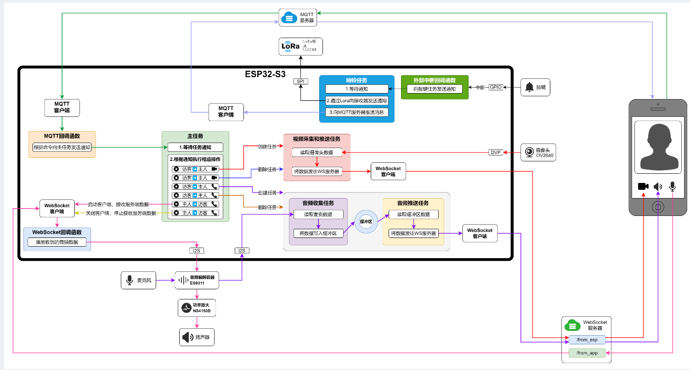

项目实战

小智

门铃

门锁 

码表


### 6.1 小智 AI 语音聊天机器人

#### 项目背景

一款 AI 语音聊天机器人，支持语音交互和智能回复，可以进行日常聊天和设备操控（如查询天气、调节音量）。

#### 硬件配置

| 组件           | 型号     | 参数                                                         | 通信方式  |
| -------------- | -------- | ------------------------------------------------------------ | --------- |
| 主控           | ESP32-S3 | 主频 240MHz，内存 512KB，Flash 8MB，外扩 SPIRAM 8MB  双核 (大量环形缓冲区) | -         |
| 音频编解码器   | ES8311   | 通过adc采集模拟信号  模拟信号给es8311 编解码处理             | I2C + I2S |
| 功放(播放音频) | NS4105B  | 模拟音频信号放大                                             | -         |
| 屏幕           | ST7789V  | 320×240 分辨率 IPS  lcd                                      | SPI       |

硬件: 主控: esp32-s3  主频:240MHz 内存:512k flash:8M  双核
 es8311: i2c和i2s  音频编解码器   录音和播放

 屏幕: 简单的lvgl  显示聊天内容16   配网二维码 emoji表情    时间 对话内容  wfii连接  电池电量  说话状态


代码约4000行    **烧录固件**：约 **4.75 MB** 

#### 软件架构

##### 1. 智能配网

| 方式       | 技术               |
| ---------- | ------------------ |
| 低功耗蓝牙 | BLE 配网           |
| WiFi 配网  | 热点 + HTTP Server |

##### 2. 数据流程

**上行流程（录音上传）**：

通过adc采集模拟信号  模拟信号给es8311 编解码处理

**PCM**（Pulse Code Modulation）： 都是音频数据格式 

​	脉冲编码调制，**原始未压缩音频**直接记录声波振幅的数值,数据量大（16kHz采样率，每秒32KB），但音质无损,麦克风采集和扬声器播放的都是PCM

**Opus**： 一帧60ms

- **高效音频压缩编码格式**专为实时通信设计（网络传输用）,低延迟、高压缩率（相比PCM可压缩10倍以上）智能区分语音和音乐，自动优化

  

1. **adc采集麦克风模拟信号** → ES8311 ADC 转换 → **I2S读取PCM数据**
2. **es2buff任务** → 从ES8311读取512字节PCM → 存入 `es8311_to_sr_buffer` 环形缓冲区
3. **buff2sr任务** → 取出PCM → 送入**本地SR模型**（唤醒词识别 + VAD人声检测）
   - 未检测到唤醒词 → 丢弃数据
   - 检测到唤醒词 → 触发回调，设置状态机为聆听  `is_wakup=true`
4. **sr2buffer任务** → 唤醒后的人声数据 → 存入 `sr_to_encoder_buff` 缓冲区
5. **BUFF2encoder任务** → PCM数据 → **pcm格式转成Opus编码(1帧60ms)**（压缩）→ 存入 `encoder_to_ws_buff` 缓冲区
6. **upload任务** → 检查 `communicationStatus==LISTENING` → 取出Opus数据 → **WebSocket发送**到服务器

- 只有检测到唤醒词后，VAD检测到用户说话状态切换 (（`SILENCE_TO_SPEECH`），数据才会进入编码和上传环节

- 用户说完（`SPEECH_TO_SILENCE`），停止上传，等待服务器回复

- **VAD**（Voice Activity Detection，语音活动检测）的原理：

  VAD通过分析音频信号的**能量/幅度**来判断是否有人声，在回调函数中处理，避免把环境噪音发给服务器，只有真正的人声才上传  

**下行流程（播放回复）**：

1. **WebSocket接收** → 服务器下发Opus格式的AI语音数据 (音频文本)→ 触发`App_Communication_WebsocketReceiveHandle`
2. **存入缓冲区** → 音频数据（二进制）写入 `ws_to_decoder_buff` 环形缓冲区（32KB）
3. **decoder任务解码** → `App_Audio_BufferToDecoderTaskFunc` 从缓冲区取出Opus数据 → 调用 `Inf_Decoder_Decode()` **解码成PCM格式**，文本显示在lvgl
4. **ES8311 DAC转换** → PCM数字信号送入ES8311 → **DAC（数模转换）** 转成模拟音频信号
5. **扬声器播放** → 模拟信号输出到扬声器，用户听到AI的回复


在本地唤醒，只上传有人声的 ，靠sr模型的vad检测人声

vad配置

opus格式 1帧60ms 服务器需求

卡顿     编码解码放在cpu不同核心 提高相应任务优先级

##### 3. 状态机

语音识别状态、唤醒状态、睡眠状态的切换，使用全局标志位实现。

 状态切换由**VAD事件**和**服务器消息**共同驱动。 


 偶发性死机、内存泄露、任务阻塞 

#### 面试问题：

```
 一 ：播放卡顿 , AI回复音频播放卡顿，出现"爆破音"。 Opus编解码实时性不足
原因：编解码任务与其他任务抢占CPU，
解决：
编解码任务绑定到Core 1（xTaskCreatePinnedToCoreWithCaps）
WiFi相关任务在Core 0运行（ESP32默认）
增加任务优先级：decoder(7) > encoder(6) > upload(6)
使用PSRAM存储中间数据，减少内部RAM压力

二：  网络波动引发的状态机错乱（最难复现）
现象：用户反馈"，断网重连后有时候会叫了没反应"或"AI一直在说话，打断不了"，重启后恢复正常。

根本原因：
WiFi重连时，WebSocket未完全断开就重新连接，导致双连接，设备收到两份数据导致错乱崩溃
tts/stop 消息在重连时丢失，communicationStatus 卡在 SPEAKING
状态切换依赖服务器消息，网络延迟时用户操作（按键）与状态不同步
检测方法：
状态停留超30秒自动报警（SPEAKING/LISTENING不应这么久）

预防措施，解决方法：
WebSocket重连时强制重置所有状态标志和缓冲区
唤醒时检查当前状态，强制回到IDLE再开始

三:  偶发性内存泄漏导致的随机重启
现象：设备运行几小时到几天后突然重启，日志显示 Heap exhausted 或 Stack overflow，但刚启动时内存充足。
	为什么难定位：
	根本原因：

session_id = strdup() 每次重连都分配新内存，旧内存未释放
cJSON_PrintUnformatted 生成的字符串偶尔未 free（异常分支跳过）
WebSocket异常断开时，环形缓冲区中的数据块未回收

泄漏速度慢（几KB/小时），开发测试阶段发现不了
重启后日志丢失，无法追溯最后一次操作
与使用频率相关（对话越多，JSON解析越频繁，泄漏越快）
解决 ：内存下降到阈值时，释放内存的标签和大小
	  重连WebSocket前强制释放session_id旧内存
```


使用I2S进行音频采集时，至少需要几根信号线，为什么？

- 最少需要三根信号线才能进行音频数据传输。
- BCLK（位时钟）：控制每一位PCM数据的传输速率。MCU或音频解码器根据这个时钟同步发送/接收每一位数据
- LRCK（左右声道选择，Word Select  WS）：决定当前传输的是左声道还是右声道。通常是每个采样周期翻转一次
- SD（Serial Data）:音频数据，实际传输PCM或压缩音频数据的串行线


#### 智能配网

BLE配网流程是如何设计的？

- 设备进入配网状态，开启BLE广播
- App连接BLE，写入SSID、密码
- ESP32校验数据并保存到NVS中
- 切换到WiFi - STA模式连接路由器
- 成功后关闭BLE进入低功耗


#### 小智总结

```
我们做的这个AI小智是一个嵌入式AI语音交互设备，主要功能是进行人声识别并与云端AI大模型服务器进行交互，可以进行日常聊天和设备操控，比如询问今天天气、调节音量、控制灯光等。

	硬件选型方面，因为整个设备需要进行语音识别、联网和处理大量的音频数据，所以MCU我们选择了自带蓝牙和WiFi的ESP32-S3FN8，双核，主频240MHz能快速处理音频数据，内置512KB内存和8MB Flash，同时外置了8MB PSRAM用于大数据缓存。在音频编解码器选择ES8311，通过I2C进行控制，I2S进行音频数据收发，麦克风采样的PCM音频数据采样频率为16kHz、位深16位。。显示采用320x240分辨率的IPS屏幕，驱动芯片ST7789V，通过SPI与ESP32通信。
	opus格式 1帧60ms 服务器需求
软件部分的核心是将Opus格式的音频数据通过WebSocket协议与服务器进行双向实时通信。音频处理链路分为上行和下行，我们创建多个freertos任务和环形缓冲区对大量音频数据进行处理：
	数据上行流程（麦克风 → 服务器）：
	ADC采集麦克风模拟信号 →模拟信号给 ES8311编码处理pcm → I2S读取PCM数据 → es2buff任务读取512字节PCM存入环形缓冲区 → buff2sr任务送入本地SR模型（唤醒词识别 + VAD人声检测）。未检测到"小爱同学"则丢弃数据；检测到后触发回调设置is_wakup=true，sr2buffer任务将唤醒后的人声存入sr_to_encoder_buff → BUFF2encoder任务将PCM编码为Opus格式（60ms/帧）→ upload任务检查communicationStatus==LISTENING后通过WebSocket上传服务器。只有VAD检测到SILENCE_TO_SPEECH（用户开始说话）数据才会进入编码上传；检测到SPEECH_TO_SILENCE（用户说完）则停止上传，等待服务器回复。

	数据下行流程（服务器 → 扬声器）：
	服务器下发Opus格式AI语音数据及JSON文本 → WebSocket触发App_Communication_WebsocketReceiveHandle → 音频数据写入ws_to_decoder_buff环形缓冲区 → decoder任务取出Opus数据解码为PCM → 同时JSON文本解析后通过LVGL显示在屏幕上（stt/tts/llm/iot不同类型分别处理）→ PCM数字信号送入ES8311经DAC转换为模拟音频 → 扬声器播放，用户听到AI回复。
	
	

	接收解码链路：云端返回的数据分为音频和文本两类。音频是Opus格式，通过websocket接到数据存入缓冲区内，再通过decoder任务解码为PCM后，把PCM数据送入ES8311 → **DAC（数模转换）** 转成模拟音频信号， 再把模拟信号输出到扬声器，让用户听到AI的回复；文本是JSON格式，我们针对不同类型的消息设置了对应的处理逻辑：

stt：语音转文字，将用户说的话显示在屏幕上用于确认识别准确性
tts：包含start（AI开始说话）、sentence_start（每句话开始）、stop（对话结束）三种状态，控制界面显示"说话中"或"聆听中"
llm：AI回复的表情包，显示在屏幕上增加交互趣味性
iot：设备控制指令，如调节音量、静音开关、控制LED灯等，通过解析JSON中的method和parameters执行对应操作
状态管理方面，我们设计了一个简单的状态机管理三种状态：IDLE（空闲等待唤醒）、LISTENING（聆听用户说话）、SPEAKING（AI播放回复）。状态切换由VAD（语音活动检测）和服务器消息共同触发，使用全局标志位communicationStatus进行控制。

UI界面使用LVGL实现，显示配网二维码，包含状态栏和对话主窗口。状态栏显示当前状态（配网中/聆听中/说话中）、WiFi连接状态、以及电量。主窗口显示用户语音文本（stt）和AI回复文本，AI回复使用30号字体，表情使用64号字体，状态栏使用20号字体。界面还实时显示时间和日期信息。

这就是整个AI小智项目的软硬件架构。

```


### 6.2 智能门铃

#### 项目背景

智能家居子项目，实现门铃 + 电子猫眼功能。

应用在智能家居，可以让用户通过摄像头观察门口情况；实现用户与门口人员的语音对讲以及OTA升级。



#### 系统组成

- **室外机**：摄像头、麦克风、按键，照明灯,电池供电

- **室内机**：显示屏、扬声器响铃 ，直接供电

- **APP 端**：远程查看、对讲

- **WebSocket 服务器**：信令中转

- **MQTT 服务器**：消息推送

  室内机室外机通过蓝牙 

#### 硬件配置

| 组件       | 型号        | 通信方式  |
| ---------- | ----------- | --------- |
| 主控       | ESP32-S3 c3 | -         |
| 音频编解码 | ES8311      | I2C + I2S |
| 功放       | NS4105B     | -         |
| 摄像头     | OV2640      | I2C + DVP |

接收器 使用c3 播放扬声器 

##### 音频相关

**音频采样率**   :1s进行多少次采样

**音频采样深度**:

​	每一次的采样通过ADC转换之后的结果是多少位[ADC位数]

**PCM** :原始的数字音频，没有经过任何压缩

**通道数**:  输入通道   几个麦克风  输出通道

**数据格式**: 菲利普格式  MSB格式  PCM帧同步格式

#### 软件功能

##### 1. 配网流程

首次启动使用 ESP-IDF 配网 API（BLE 方式）：

1. 建立蓝牙连接
2. 接收 WiFi 配置信息
3. 保存配置信息
4. 连接 WiFi.
5. 向 MQTT topic-A 发送 Ready 数据
6. 订阅 topic-B 接收后续指令

##### 2. 按铃流程

1. 通过 LoRa 向室内接收器发送通知 → 接收器响铃
2. 向 MQTT 服务器推送消息 → APP 收到通知
3. 主机本身响铃（反馈访客）

##### 3. 音视频通话

1. APP 向 MQTT 发送开启摄像头和麦克风指令
2. 主机收到指令后开始收集摄像头和麦克风数据
3. 将数据推送到 WebSocket 服务器
4. APP 获取门外音视频数据
5. APP 麦克风数据通过 WebSocket 推送到主机 → 扬声器播放

##### 4. OTA 升级

- 创建专用 OTA 任务，平时阻塞等待通知
- APP 检测新版固件后发送 OTA 指令
- 调用 `esp_https_ota` 下载固件
- 下载成功后调用 `esp_restart` 重启

**分区表**：ota_0 + ota_1 + ota_data


#### 常见面试问题

**Q1：音频采集流程中异步缓冲区大小？**

> 16*1024 byte，需多测试各种网络状态。大了延迟高，小了容易破音。

**Q2：视频采集为什么不采用异步？**

> 音频采用同步可能会丢数据影响用户体验，视频采用同步丢数据最多掉帧卡顿，可接受。

**Q3：蓝牙配网流程？是否支持 AP 配网？**

> 使用 ESP-IDF 提供的配网 API，支持两种方式：热点配网和低功耗蓝牙配网，项目中选择蓝牙方式。流程包括：建立蓝牙连接 → 接收 WiFi 配置 → 保存配置 → 连接 WiFi → 发送 Ready 数据到 MQTT。

**Q4：WebSocket 并发量和延迟？**

> 实际生活：几十到几百并发。延迟：亚秒级别，半秒到 1 秒，网络不好会卡顿。

采样率 16khz 采样深度 16位

**Q5：I2C 和 I2S 的区别？**

| 协议    | 场景           | 拓扑           | 工作方式      | 速率              | 线路                | 数据格式                   |
| ------- | -------------- | -------------- | ------------- | ----------------- | ------------------- | -------------------------- |
| **I2S** | 数字音频设备   | 点对点         | 全双工/半双工 | 快，可达数十 Mbps | 3-4 线：SD、WS、SCK | 固定为音频 PCM 数据        |
| **I2C** | MCU 和外围设备 | 多设备共享总线 | 半双工        | 慢，最快 3.4Mbps  | 2 线：SCL、SDA      | 任意：命令、配置、寄存器值 |

---


#### 总结

```
五、智能门铃
这个门铃，分为门铃主机、室内接收器和手机APP三个部分，我们部门主要负责主机和接收器的开发。主机上有一个门铃按键、一个摄像头、一个麦克风，还有一个扬声器,一个补光灯。接收器上有一个扬声器和两个音量按键，两部分通过蓝牙进行通信。
这个门铃的使用逻辑很简单，就是当有人按下门铃时，室内接收器就会响铃，同时手机APP会收到一个通知，然后用户可以使用手机APP与访客进行语音通话，也可以查看门外的实时画面。
下面我介绍一下项目的硬件选型，门铃的主控选用的是乐鑫的ESP32-S3，这个芯片集成了WIFI、蓝牙，并且提供了I2S音频接口和DVP摄像头接口，所以很符合项目的需求，然后摄像头选用的是OV2640（使用DVP接口），音频编解码芯片使用的是ES8311（使用I2S接口），功放芯片选择的是NS4105B。
接收器的主控选择的是ESP32-C3，然后音频编解码芯片和功放芯片与主机都是相同的。
然后我再介绍一下这个项目的实现细节
首次启动门铃主机时，需要进行WIFI配网操作，需要使用手机app扫描设备机身上的二维码进行配网。这部分逻辑是使用ESP-IDF提供的配网API实现的，它提供了两种配网方式，一种是通过热点，另一种是通过低功耗蓝牙，我们选择的是第二种。这个配网API实现了配网所需的所有步骤，包括建立蓝牙连接、接收WIFI配置信息，保存WIFI配置信息等等。配网成功后，主机就会连接WIFI，然后向后台的MQTT服务器的一个topic-A发送一条Ready准备就绪数据，之后手机APP就会显示门铃已就绪，同时还会订阅另一个topic-B，用于接收后续手机APP端发送的指令。
然后就是日常使用，当有人按下门铃按钮时，门铃会执行以下逻辑。
首先通过LoRa向室内的接收器，发送通知，接收器收到通知后就会响铃。
然后还会向MQTT服务器推送一条消息，此时用户的手机APP就会收到一条通知：有人按门铃最后主机本身也会响铃，主要是告诉访客，门铃已经响应了，手机APP端再收到通知后，可以打开主机的摄像头和麦克风，查看访客身份，这功能实现逻辑也比较简单。首先手机APP会向MQTT服务器发送一个开启摄像头和麦克风的指令，发往的就是主机订阅的那个topic。当主机收到这个指令后，就会开始收集摄像头和麦克风数据，并将数据推送到一个WebSocket服务器，然后手机端就能获取门外的音视频数据了。另外，手机端app也可以收集手机这一端的麦克风数据和访客进行实时对讲，此时手机app会将mic数据推送到WebSocket服务器，并进一步推送到主机，主机在收到收据后，会使用扬声器播放。
以上就是核心功能的实现逻辑，除此之外我们还实现了OTA升级。
	这部分功能也是使用ESP-IDF提供的相关API实现的。我们创建了一个任务专门用于OTA升级，这个任务在平时会以阻塞的状态等待任务通知，当手机APP检测到有新版固件后，就会向MQTT服务器发送OTA升级的指令，门铃这边收到OTA指令后，就会向这个OTA任务发送通知，这个任务收到通知后，就会调用ESP-IDF提供的esp_https_ota函数，从我们指定的后台服务器，下载新版本的固件，下载成功后，再调用esp_restart，重启系统，这样就完成了OTA升级。
然后还需要补充一点，使用ESP-IDF提供的OTA功能时，需自己配置分区表，该分区表至少要包括两个 OTA 应用程序分区，分别是 ota_0 和 ota_1，和一个OTA数据分区 ota_data，ota_0和ota_1分别用于交替存储当前版本的固件和将来要下载的新版固件，而ota_data分区用于存储每次升级后，应该从哪个ota分区加载程序，这样一来，每次升级重启后，Bootloader就会根据ota_data中存储的值，去加载新版固件。
ota0和1 交替使用互为备份

	Flash 512KB 分区：
├─ Bootloader区：16KB   (0x08000000)
├─ 应用区：      200KB  (0x08004000)
├─ 下载区：      200KB  (0x08034000) ← 缓存从WiFi下载的固件
├─ 配置区：      4KB    (0x08066000) ← WiFi配置、更新标志
└─ 保留区：      92KB   (0x08067000)

特点：
├─ 应用区 = 下载区（200KB）
├─ 支持断点续传
├─ 更新安全
└─ 配置区存储WiFi账号密码

建议：物联网设备使用


```


OTA（Over-The-Air）空中升级技术，允许设备通过网络远程更新固件。

优势：
├── 远程修复Bug，无需现场更新
├── 快速迭代功能，提升用户体验
├── 降低维护成本，避免设备召回
└── 延长产品生命周期

esp32的ota成功后会标记为有效状态，失败后就会触发看门狗复位回滚

| 特性           | 一级Bootloader           | 二级Bootloader              |
| -------------- | ------------------------ | --------------------------- |
| **存储位置**   | ROM（芯片内部）          | Flash（外部存储）           |
| **地址**       | 0x40000000（ROM地址）    | 0x0（Flash起始地址）        |
| **是否可修改** | ❌ 不可修改，出厂固化     | ✅ 可配置，esp-idf生成       |
| **代码来源**   | 乐鑫出厂写入             | esp-idf编译生成             |
| **主要功能**   | 硬件初始化、加载二级Boot | 分区选择、加载APP、安全启动 |
| **大小**       | 约32KB                   | 约24KB                      |

```
OTA即Over-The-Air空中升级技术，允许设备通过网络远程更新固件。

以ESP32为例，其核心是双分区交替写入机制。Flash划分为ota_0和ota_1两个APP分区，当前运行A分区时，下载的固件写入B分区。写入完成后，更新OTA Data分区的状态标记为"待验证"，然后重启。

重启后Bootloader读取OTA Data，启动新固件。新固件启动后需要进行自检，自检成功则调用API标记为"有效"；如果自检失败或看门狗超时，Bootloader会自动回滚到旧固件。

这种设计保证了升级的原子性和可恢复性：要么成功升级，要么恢复旧版本，不会出现设备变砖的情况。

此外，ESP32还支持Secure Boot固件签名验证、Flash加密、版本号防降级等安全机制，确保升级过程安全可控。
```


```
设备进入配网状态，开启BLE广播.App连接BLE，写入SSID、密码.
ESP32校验数据并保存到NVS中.切换到WiFi - STA模式连接路由器.成功后关闭BLE进入低功耗
```


### 6.3 智能门锁

#### 项目背景

智能家居子项目，替代传统机械门锁。

#### 硬件配置

| 组件     | 型号     | 通信方式 | 说明                               |
| -------- | -------- | -------- | ---------------------------------- |
| 主控     | ESP32-C3 | -        | 主频 160MHz，内存 400KB，Flash 4MB |
| 触摸按键 | SC12B    | I2C      | 支持 12 个触摸按键                 |
| 指纹模块 | FPM383   | 串口     | 自定义数据格式，容量 50 枚         |
| 语音模块 | WTN6170  | 一线串口 | 语音提示                           |
| 全色灯   | WS2812   | RMT 驱动 | 一线串口                           |
| 电机驱动 | BDR6120  | GPIO     | 内置 MOS 管                        |

#### 软件功能

##### 1. 开锁方式

| 方式         | 实现            | 细节                                                  |
| ------------ | --------------- | ----------------------------------------------------- |
| **密码开锁** | 输入密码匹配    | 以 `#` 结束，支持防偷窥（前后可输入随机数字）         |
| **指纹开锁** | FPM383 验证     | 一站式验证指令，自动感应                              |
| **蓝牙开锁** | BLE 通信        | 首次需配对码，之后自动连接                            |
| **远程开锁** | MQTT / 临时密码 | 方案1：MQTT 实时指令；方案2：基于时间戳的临时密码算法 |


##### 2. 密码管理

| 操作         | 流程                                                     |
| ------------ | -------------------------------------------------------- |
| **添加密码** | 输入管理员密码 → 验证 → 输入新密码两次 → 存储到 NVS      |
| **删除密码** | 输入管理员密码 → 验证 → 输入要删的密码两次 → 从 NVS 删除 |

##### 3. 指纹管理

| 操作         | 流程                                                         |
| ------------ | ------------------------------------------------------------ |
| **添加指纹** | 输入管理员密码 → 发送添加指令 → 按压手指多次 → 存储到模组（容量50枚） |
| **删除指纹** | 输入管理员密码 → 发送删除指令 → 指定 ID 删除                 |

##### 4. OTA 升级

- 自定义分区表：2 个 OTA 应用分区 + 1 个数据分区

- 使用 `esp_https_ota` 组件

  OTA 功能启动后，向当前未用于启动的 OTA 应用分区写入新的应用固件镜像。镜像验证后，OTA 数据分区更新，指定在下一次启动时使用该镜像。

在项目的根目录下创建文件partitions.csv


##### 5. 低功耗设计

| 组件     | 进入低功耗               | 退出低功耗         |
| -------- | ------------------------ | ------------------ |
| ESP32-C3 | DFS + Light Sleep        | 事件唤醒           |
| SC12B    | 75 秒无按键且 SDA 高电平 | 检测到按键自动退出 |
| FPM383   | 发送 Sleep 指令          | 手指按压自动退出   |
| WTN6170  | 播放完成 2 秒后          | 播放指令唤醒       |
| WiFi     | 随用随开                 | -                  |
| 蓝牙     | BLE 模式                 | -                  |

##### 6. 电机堵转保护

检测电流或编码器反馈，发现堵转立即停止并报警。

#### 常见面试问题

**Q1：智能门锁为什么用 FreeRTOS？**

> ESP-IDF 集成了 FreeRTOS，开发简化，便于管理多个任务（开锁、指纹、OTA、按键处理）。

**Q2：指纹开锁的实现逻辑？**

> 利用 FreeRTOS 任务通知：指纹识别任务以阻塞状态等待通知，指纹模块识别到指纹时通过中断回调函数发送通知，任务唤醒后通过串口查询识别结果，成功则驱动电机开锁。

**Q3：OTA 升级失败怎么办？**

> ESP32 自动处理：OTA 数据分区记录当前固件位置，失败后仍从原分区启动。可添加失败重试机制和次数限制。

**Q4：低功耗如何实现？**

> 采用 `DFS + Auto Light-Sleep + Bluetooth Modem-sleep` 组合：
>
> - DFS：动态频率切换，空闲时降频
> - Auto Light-Sleep：系统空闲超过设定时间自动进入休眠，关闭 RF、PLL 等
> - Bluetooth Modem-sleep：保持蓝牙连接的同时降低功耗
> - 唤醒源：GPIO 唤醒（触摸按键中断、指纹中断）

**Q5：门锁续航多久？如何测试？**

> 半年到两年多（看使用频率）。测试方法：多台设备运行一周，查看电池电量损耗，推算使用时长，取平均值。

---

### 6.5 牛羊定位器

#### 项目背景

智慧农业子项目，实现牛羊位置追踪和运动量监测。

#### 硬件配置

| 组件       | 型号          | 通信 | 说明                                             |
| ---------- | ------------- | ---- | ------------------------------------------------ |
| 主控       | STM32F103C8T6 | -    | 主频 72MHz（实际使用 8MHz），内存 20KB,flash 64k |
| GPS 模块   | AT6558R       | 串口 | 支持北斗 + GPS 多模定位                          |
| NB-IoT     | QS100         | 串口 | AT 指令，低功耗广域网                            |
| 计步传感器 | DS3553        | I2C  | 内置 8 位 CPU，预计算步数                        |
| LoRa       | LLCC68        | SPI  | 远距离低功耗通信                                 |

#### 软件架构

**开发方式**：裸机开发（简单业务逻辑，无需 RTOS）

**业务流程**：

```
读取 GPS 数据 ──┐
              ├──→ 封装 JSON → NB-IoT 上传云端
读取步数数据 ───┘
                  ↓
            NB 无信号时 → LoRa 发送给网关
```

#### 低功耗设计

| 组件      | 低功耗模式          | 唤醒方式                |
| --------- | ------------------- | ----------------------- |
| STM32F103 | 待机模式（Standby） | 闹钟中断                |
| QS100     | PSM 模式            | 唤醒引脚高电平 100ms-5s |
| GPS       | 断电                | 重新上电                |
| DS3553    | 静止 15s 自动进入   | 检测到运动自动退出      |
| LoRa      | 睡眠模式            | 定时唤醒                |

**电池**：锂亚电池，容量 9000mAh，可工作约一年

#### 常见面试问题

**Q1：NB-IoT 推送云端采用什么协议？**

> MQTT 协议。

**Q2：GPS 数据除了经纬度还有什么？**

> NMEA 0183 格式数据，包含：
>
> - 时间（UTC）
> - 纬度/经度
> - 地面速率（节）
> - 地面航向（度）
> - 日期
> - 定位模式、卫星状态等

**Q3：牧场大量牛 LoRa 通信如何解决数据冲突？**

> 使用 ACK 应答机制，发送后等待接收方确认，冲突时重传。

**Q4：定位器低功耗如何实现？**

> 发送成功一次数据后立即进入低功耗模式：
>
> - STM32：进入待机模式（RTC 闹钟唤醒）
> - NB-IoT：发送 AT 指令进入低功耗 `AT+FASTOFF=0`
> - GPS：拉低 EN 引脚关机
> - LoRa：不发送期间自动进入低功耗
> - 计步器：静止 15s 自动进入低功耗

---

### 6.7 STM32网关与步进电机控制

#### 项目背景

为不具备联网能力的设备提供联网能力，支持多种通信协议；同时实现步进电机的精确控制。

#### 硬件配置

**STM32网关部分：**

| 组件       | 型号          | 通信方式 | 说明                       |
| ---------- | ------------- | -------- | -------------------------- |
| 主控       | STM32F103C8T6 | -        | 支持串口、SPI、CAN，成本低 |
| RS485 模块 | MAX13487EESA+ | 串口     | Modbus-RTU 协议            |
| CAN 模块   | PD1050S       | CAN      | 自定义协议                 |
| LoRa 模块  | LLCC68        | SPI      | 远距离通信                 |
| 以太网模块 | W5500         | SPI      | MQTT 协议                  |
| NB-IoT     | QS100         | 串口     | AT 指令                    |

**步进电机控制部分：**

| 组件     | 型号             | 说明                |
| -------- | ---------------- | ------------------- |
| 电机类型 | 混合式步进电机   | 两相四线双极性驱动  |
| 步进角度 | 1.8°             | 200步/圈            |
| 驱动芯片 | 东芝 TB 系列     | 支持1/4步细分       |
| 编码器   | 1000线光电编码器 | 四倍频后4000脉冲/圈 |

#### 软件架构

##### 网关任务划分

| 任务               | 功能                                        |
| ------------------ | ------------------------------------------- |
| **网络任务**       | MQTT 连接，上传数据到云服务器，获取远端命令 |
| **RS485 处理任务** | 封装协议帧，下发指令，接收响应              |
| **LoRa 处理任务**  | LoRa 通信，自定义协议                       |
| **CAN 处理任务**   | CAN 通信，差分信号收发                      |
| **电机控制任务**   | 步进电机运动控制                            |

##### 协议格式

**Modbus-RTU**：

```
设备地址(1字节) + 功能码(1字节) + 数据(N字节) + CRC校验(2字节)
```

**LoRa 自定义协议**：

```
帧头校验 + 命令内容 + 帧尾校验

命令类型：启动停止、转向、转速控制
```

**CAN**：使用报文 ID 标识电机和网关

##### 步进电机控制

**转动原理**：
通过交替改变 A 相和 B 相电流方向，控制转子受力。转子每次转动 1/4 齿，即 200 次转一圈。

**细分控制**：
1/4 步分辨率，给驱动芯片发送 4 个脉冲 = 电机转一步 = 800 个脉冲转一圈

**速度和步数控制**：

- **速度控制**：控制发送脉冲的频率（STM32 定时器比较输出）
- **步数控制**：在定时器比较中断中计数，每两个中断记录一步

**加减速算法**：

| 算法           | 特点                             |
| -------------- | -------------------------------- |
| **梯形算法**   | 加速度恒定，加速和减速阶段匀变速 |
| **S 形算法**   | 加速度先增后减，曲线更平滑       |
| **增量式 PID** | 需配合光电编码器，实现闭环控制   |

**编码器反馈**：

- **规格**：1000 线光电编码器
- **四倍频**：AB 相同时采集变化沿，转一圈采集 4000 个信号

**适用场景**：
低转速、低负载场景。高转速可能导致堵转和丢步。

---

---

### 6.6 自行车码表

#### 项目背景

（待补充）

#### 硬件配置

| 组件       | 型号 | 通信方式 | 说明 |
| ---------- | ---- | -------- | ---- |
| （待补充） |      |          |      |

#### 软件架构

（待补充）

---

### 6.8 Linux 智能网关

#### 项目背景

为不具备联网能力的低功耗设备提供联网能力，作为数据中转站，支持高并发和稳定运行。

#### 硬件配置

| 组件      | 型号          | 说明                                   |
| --------- | ------------- | -------------------------------------- |
| 主控      | 全志 V3S      | Cortex-A7，主频 1.2GHz，RAM 512MB/64MB |
| 电源      | 220V 开关电源 | 转 5V，直接插电无需考虑低功耗          |
| LoRa 模块 | LLCC68        | SPI 通信，433MHz 频段                  |
| 以太网    | 内置          | 通过 MQTT 与服务器通信                 |

#### 软件架构

**进程组成**：

| 进程             | 功能                               |
| ---------------- | ---------------------------------- |
| **消息收发进程** | 核心功能，负责上下游数据转发       |
| **OTA 进程**     | 定期检查固件更新并升级             |
| **守护进程**     | 监测前两个进程健康状态，故障时重启 |

**消息收发进程实现**：

1. **上行链路**（下游→上游）：
   - 读蓝牙数据线程 → 上行缓冲区 → 线程池 → MQTT 服务器
   - 异步架构提升吞吐量

2. **下行链路**（上游→下游）：
   - MQTT 回调函数 → 下行缓冲区 → 线程池 → 蓝牙发送

3. **双缓冲机制**：
   - 读写分离，提升运行效率

**OTA 实现**：

1. 每 24 小时检查服务器最新版本和哈希值
2. 有更新则下载固件
3. SHA1 完整性校验（失败则重试）
4. 校验通过重启系统
5. 启动后守护进程监测异常（超过 10 次回退上一版本）

**守护进程**：

- 每 100ms 检查业务进程状态
- 故障时重启进程
- 连续故障 10 次以上重启系统并回退版本

#### 常见面试问题

**Q1：为什么选择 Linux 而不是 RTOS？**

> 网关需要同时处理很多下游设备数据，要求：
>
> - 成熟稳定、并发处理能力强
> - 支持多进程架构
> - 开发方便，生态丰富

**Q2：同步转异步的好处？**

> 原先 2 个线程处理，改为 2+n 个线程 + 缓存 + 消息队列：
>
> - 解耦数据接收和发送
> - 提升吞吐量
> - 避免阻塞等待

**Q3：OTA 完整性校验怎么做？**

> 计算下载固件的 SHA1 哈希值，与服务器返回的哈希值对比，不一致则重新下载。

**Q4：守护进程挂掉怎么办？**

> 守护进程不设置其他进程守护，认为其最简单最稳定，如果它也挂了系统需要人工干预。

---

## 附录A：项目串讲模板

### 一、智能门锁项目串讲

这个智能门锁项目支持多种开锁方式，包括**密码开锁、指纹开锁和手机App蓝牙开锁**，并且支持**OTA升级**功能。用户交互方面还提供了语音播报提示和键盘背光功能。

**硬件选型**：

- 主控：ESP32-C3（支持WIFI/蓝牙，集成FreeRTOS，自带esp-idf框架）
- 触摸键盘：SC12B（I2C通信，支持中断）
- 指纹模组：FPM383（UART通信，中断通知，一体化设计）
- 语音模块：WTN6170（一线串口）
- 全色灯：WS2812（RMT驱动）

**开锁方式实现**：

1. **密码开锁**：
   - 12键电容触摸键盘通过I2C与主控通信
   - 支持中断通知：按键触摸时芯片拉高中断引脚
   - 外部中断ISR与任务通过**任务通知**同步
   - 密码以`#`结尾，对比成功后GPIO驱动电机开锁

2. **指纹开锁**：
   - 一体化指纹模组（内置传感器+识别芯片）
   - UART通信，支持中断通知
   - 任务通知机制：阻塞等待→中断触发→查询结果→开锁

3. **蓝牙开锁**：
   - 基于ESP-IDF蓝牙驱动
   - 配对后发送特定指令完成开锁/管理

**OTA升级**：

- 专用OTA任务，阻塞等待通知
- 手机APP触发→连接WIFI→`esp_https_ota`下载固件→`esp_restart`重启
- 分区表：ota_0 + ota_1 + ota_data
- Bootloader根据ota_data选择加载分区

**低功耗设计**：

- `DFS + Auto Light-Sleep + Bluetooth Modem-sleep`
- 唤醒源：GPIO（触摸/指纹中断）
- 续航：半年到两年多

---

### 二、智能门铃项目串讲

这个门铃分为**门铃主机、室内接收器和手机APP**三个部分。主机有门铃按键、摄像头、麦克风和扬声器；接收器有扬声器和音量按键；两部分通过**LoRa**通信。

**硬件选型**：

- 主机：ESP32-S3（240MHz，512KB RAM，8MB Flash，16MB SPIRAM）
- 摄像头：OV2640（DVP接口）
- 音频编解码：ES8311（I2C控制+I2S数据）
- 功放：NS4105B
- 接收器：ESP32-C3

**实现细节**：

1. **配网**：
   - 使用ESP-IDF配网API，选择**BLE配网**
   - 流程：蓝牙连接→接收WIFI配置→保存→连接WIFI→MQTT发送Ready

2. **按铃流程**：
   - LoRa向接收器发通知→接收器响铃
   - MQTT推送消息→APP收到通知
   - 主机本身响铃（反馈访客）

3. **音视频通话**：
   - APP通过MQTT发送开启指令
   - 主机采集摄像头+麦克风数据→WebSocket服务器
   - APP获取音视频数据；APP麦克风数据→WebSocket→主机播放

4. **OTA升级**：
   - 专用OTA任务等待通知
   - `esp_https_ota`下载→`esp_restart`重启
   - 双分区设计（ota_0/ota_1）+ ota_data

---

### 三、AI小智项目串讲

AI聊天机器人是**嵌入式前端项目**，进行人声识别并与云端AI大模型交互，实现日常聊天和设备操控。

**硬件选型**：

- 主控：ESP32-S3（240MHz，512KB RAM，16MB Flash）
- 音频编解码：ES8311（I2C+I2S，采样率16000Hz，16位）
- 屏幕：ST7789V（320×240 IPS，SPI接口）

**软件架构**：

**上行链路**（人声→服务器）：

```
麦克风→ES8311(PCM)→Feed任务→环形缓存→Fetch任务
→Opus编码→输出缓存→WebSocket→云端
```

**下行链路**（云端响应→播放）：

```
WebSocket接收→Opus解码→PCM→ES8311→扬声器播放
```

**核心任务**：

- **Feed任务**：识别人声，PCM数据存放到环形缓存
- **Fetch任务**：数据传递给Opus编码器
- **解码任务**：Opus解码为PCM播放

**回调函数类型**：

- **STT**：Sound To Text，屏幕显示识别文字
- **TTS**：Text To Sound，包含start/sentence_start/stop
- **LLM**：AI回复表情包显示
- **IOT**：根据JSON执行硬件控制（调音量、开关灯等）

**状态机**：语音识别状态→唤醒状态→睡眠状态（全局标志位切换）

**UI显示（LVGL）**：

- 状态栏：状态机状态、电池、WiFi（20号字模）
- 会话窗口：聊天记录（30号字体）
- 表情包：64号字体

---

### 四、畜牧定位器项目串讲

畜牧定位器对农场牛羊进行**定位**和**计步**监测健康状态。

**主体逻辑**：定期获取GPS定位和步数→联网上传→APP/小程序查看统计。

**两种联网方案**：

1. **NB-IoT直接联网**：信号好时使用
2. **LoRa网关转发**：信号差时使用

**硬件选型**：

- 主控：STM32F103C8T6（72MHz，实际使用8MHz）
- GPS模块：AT6558R-5N32（串口，GPS+北斗双模）
- 计步模块：DS3553（IIC，内置加速度传感器+算法）
- NB-IoT：QS100（串口AT指令）
- LoRa：LLCC68（SPI，433MHz）
- 电池：ER-26500锂亚电池，9000mAh，续航半年到一年

**数据获取**：

- **GPS**：上电后不断获取，主动发送给主控，提取RMC信息（经纬度+速度+时间）
- **计步**：DS3553自动识别脚步并计数，主控通过IIC读取

**低功耗设计**：

- 主控：待机模式（RTC闹钟唤醒）
- NB-IoT：AT指令进入低功耗
- GPS：直接断电，唤醒后重新上电
- 计步模块：静止15s自动进入低功耗
- 主频从72MHz降低到8MHz

---

### 五、STM32网关项目串讲

网关为**不具备联网能力的设备提供联网能力**，支持RS485、LoRa、CAN与下游设备通信，以太网/NB-IoT与云端交互。

**硬件选型**：

- 主控：STM32F103C8T6（成本低、生态成熟、接口丰富）
- RS485：MAX13487EESA+（Modbus-RTU协议）
- CAN：PD1050S（自定义协议）
- LoRa：LLCC68（SPI通信）
- 以太网：W5500（SPI，MQTT协议）
- NB-IoT：QS100（串口AT指令）

**软件架构**：

**任务划分**：

- **网络任务**：MQTT连接，上传数据，获取远端命令
- **RS485处理任务**：封装协议帧，下发指令，接收响应
- **LoRa处理任务**：LoRa通信，自定义协议
- **CAN处理任务**：CAN通信，差分信号收发

**协议格式**：

- **Modbus-RTU**：设备地址(1B) + 功能码(1B) + 数据(NB) + CRC(2B)
- **LoRa自定义**：帧头校验 + 命令内容 + 帧尾校验（启动/停止/转向/转速）
- **CAN**：使用报文ID标识电机和网关

**实现细节**：

- MQTT客户端注册订阅远端服务器主题
- 回调函数使用cJSON解析字符串，提取控制指令
- RS485：USART串口通信，自定义指令拼接
- LoRa：移植LLCC68驱动，发送后进入接收模式等待返回
- CAN：差分信号收发，不同ID标识

---

### 六、步进电机控制串讲

**电机选型**：

- 类型：混合式步进电机
- 规格：两相四线双极性，200步/圈，1.8°/步
- 结构：定子48齿（8组线圈），转子50齿（永磁体）

**转动原理**：

- 交替改变A相和B相电流方向控制转子受力
- 转子每次转动1/4个齿，200次转1圈
- 使用东芝TB驱动芯片，1/4步细分：800脉冲/圈

**控制方法**：

- **转速控制**：控制脉冲频率（STM32定时器比较输出）
- **步数控制**：定时器比较中断中计数，每两个中断记录一步

**加减速算法**：

- **梯形算法**：加速度恒定，匀变速
- **S形算法**：加速度先增后减，曲线平滑
- **增量式PID**：配合编码器实现闭环控制

**编码器反馈**：

- 1000线光电编码器
- 四倍频（AB相同时采集变化沿）：4000脉冲/圈
- 增量式PID调节，平滑加减速曲线

**适用场景**：低转速、低负载。高转速可能导致堵转和丢步。

---

## 附录B：C语言速查表

| 知识点               | 要点                                                      |
| -------------------- | --------------------------------------------------------- |
| **源码到可执行文件** | 预处理→编译→汇编→链接                                     |
| **内存模型**         | 栈（函数调用）、堆（malloc）、数据区（全局/静态）、代码区 |
| **堆栈区别**         | 堆自下而上、慢、面向用户；栈自上而下、快、面向OS          |
| **字节序**           | ARM小端序：`*(char *)&i == 1`判断                         |
| **指针和引用**       | 指针可不初始化，引用必须初始化且不可更改                  |
| **回调函数**         | 函数指针作为参数，满足条件时调用（MQTT/蓝牙回调）         |
| **volatile**         | 防止编译器优化，强制从内存读取                            |
| **内存泄漏**         | malloc未free；**内存溢出**OOM直接报错                     |

---

## 附录

### 常用缩写对照

| 缩写 | 全称                                        | 中文                 |
| ---- | ------------------------------------------- | -------------------- |
| ADC  | Analog-to-Digital Converter                 | 模数转换器           |
| DAC  | Digital-to-Analog Converter                 | 数模转换器           |
| PWM  | Pulse Width Modulation                      | 脉冲宽度调制         |
| I2C  | Inter-Integrated Circuit                    | 集成电路总线         |
| SPI  | Serial Peripheral Interface                 | 串行外设接口         |
| UART | Universal Asynchronous Receiver/Transmitter | 通用异步收发传输器   |
| GPIO | General Purpose Input/Output                | 通用输入输出         |
| RTOS | Real-Time Operating System                  | 实时操作系统         |
| BLE  | Bluetooth Low Energy                        | 低功耗蓝牙           |
| NVS  | Non-Volatile Storage                        | 非易失性存储         |
| OTA  | Over-The-Air                                | 空中升级             |
| PID  | Proportional-Integral-Derivative            | 比例-积分-微分控制   |
| MQTT | Message Queuing Telemetry Transport         | 消息队列遥测传输协议 |
| DMA  | Direct Memory Access                        | 直接内存访问         |

---

*整理时间：2025年*