# \智能加湿器

14.9mm  核心板 

typec 模块 575mil


作业1(灯板)：串口发送一个数字（1-99）到主控芯片，主控芯片存储到eeprom中，按下按键读取eeprom的数据显示到灯板1。
（主要学习GD32 串口，i2c,按键中断，灯板驱动）
GD32 开发
作业2：实现OTA，编写bootloader程序，通过接收串口的传输过来的Bin文件程序，主程序正常执行流水灯功能，OTA，WS2812的亮灯程序

作业  GD32F103ZET6  108MHZ

灯板 

- GD32对时序要求更严格，配置外设需要**先打开时钟，再进行外设配置**


串口：

#为什么串口需要回车/空格结束符？以及替代方案

 为什么需要结束符？

串口通信需要结束符（如回车`\r`、换行`\n`或空格）的根本原因是：**串口是流式传输，没有明确的帧边界**。

 核心问题：数据边界不明确

- 串口发送的是连续的字节流，没有"帧"的概念
- 接收方无法判断"5"和"52"哪个是完整输入
- 例如：输入"52"时，串口会先收到`'5'`，再收到`'2'`，接收方不知道是等待第二个数字还是已经完成输入

 替代方案：不需要结束符的方法

1. 超时机制（推荐方案）

这是最实用的替代方法，不需要任何结束符，而是通过**时间间隔**判断输入结束：

```c
void USART0_IRQHandler(void)
{
    uint8_t rx_data = 0;
    
    if (usart_interrupt_flag_get(USART0, USART_INT_FLAG_RBNE) != RESET)
    {
        rx_data = usart_data_receive(USART0);
        usart_interrupt_flag_clear(USART0, USART_INT_FLAG_RBNE);
        usart_data_transmit(USART0, rx_data);  // 串口回显
        
        // 仅处理数字字符 '0'-'9'
        if (rx_data >= '0' && rx_data <= '9')
        {
            // 1. 存储数字字符（最多2位）
            if (g_uart_rx_len < 2)
            {
                g_uart_rx_buf[g_uart_rx_len++] = rx_data;
            }
            // 2. 不立即处理，等待第二个数字或非数字字符
        }
        // 3. 遇到非数字字符（包括回车/空格等）时处理完整数字
        else
        {
            // 只有在有数字输入时才处理
            if (g_uart_rx_len > 0)
            {
                // 转换数字（1位或2位）
                if (g_uart_rx_len == 1)
                {
                    g_uart_num = g_uart_rx_buf[0] - '0';
                }
                else // g_uart_rx_len == 2
                {
                    g_uart_num = (g_uart_rx_buf[0] - '0') * 10 + (g_uart_rx_buf[1] - '0');
                }
                
                // 有效范围校验 (1-99)
                if (g_uart_num >= 1 && g_uart_num <= 99)
                {
                    g_uart_rx_ok = 1;  // 标记有效输入
                }
                
                // 重置接收状态
                g_uart_rx_len = 0;
                memset(g_uart_rx_buf, 0, sizeof(g_uart_rx_buf));
            }
        }
    }
}

```

```
 // 检查当前输入是否已超出范围（当输入2位时）
                if (g_uart_rx_len == 2)
                {
                    uint8_t temp_num = (g_uart_rx_buf[0] - '0') * 10 + (g_uart_rx_buf[1] - '0');
                    if (temp_num > 99)
                    {
                        // 超出范围，立即重置缓冲区
                        g_uart_rx_len = 0;
                        memset(g_uart_rx_buf, 0, sizeof(g_uart_rx_buf));
                    }
                }
            }
```

 

ASCLL 

`g_uart_rx_buf[0] - '0'` 的作用

这段代码使了C语言中一个非常常见的技巧：**将字符型数字转换为整数值**。下面我将详细解释这个操作的原理和作用。

## 核心原理

在C语言中，字符（如 `'0'`, `'1'`, `'2'` 等）是以**ASCII码**形式存储的。它们的ASCII码值如下：

| 字符 | ASCII码值 |
| ---- | --------- |
| '0'  | 48        |
| '1'  | 49        |
| '2'  | 50        |
| '3'  | 51        |
| ...  | ...       |
| '9'  | 57        |

因此，当我们执行 `g_uart_rx_buf[0] - '0'` 时，实际上是在进行ASCII码值的减法运算。

## 详细解释

### 1. 单个数字字符转换（`g_uart_rx_len == 1`）

C

编辑


```
1g_uart_num = g_uart_rx_buf[0] - '0';
```

- 假设 `g_uart_rx_buf[0]` 是字符 `'5'`（ASCII码 53）
- `'0'` 的ASCII码是 48
- `53 - 48 = 5`
- 所以 `g_uart_num` 被设置为整数 5

### 2. 两位数字字符转换（`g_uart_rx_len == 2`）

```
1g_uart_num = (g_uart_rx_buf[0] - '0') * 10 + (g_uart_rx_buf[1] - '0');
```

- 假设 `g_uart_rx_buf[0]` 是 `'1'`（ASCII码 49），`g_uart_rx_buf[1]` 是 `'2'`（ASCII码 50）
- `(49 - 48) * 10 + (50 - 48) = 1 * 10 + 2 = 12`
- 所以 `g_uart_num` 被设置为整数 12

## 为什么使用 `'0'` 而不是 `48`？

从知识库[4]中可以看到：

> "C语言中字符转数字、数字转字符，到底是加'0'还是减'0'？ 一句话记住： 字符变数字 → 减 '0' 数字变字符 → 加 '0'"

使用 `'0'` 比使用 `48` 更具可读性，也更符合代码意图。代码的意图是"将字符数字转换为整数"，使用 `'0'` 直接表达了这个意图，而使用 `48` 则需要额外解释。


gpio引脚需要重定义 

无法拉高拉低  晶振坏了 引脚虚焊 


| 存储器     | 电脑类比      | MCU对应    | 特点                           |
| ---------- | ------------- | ---------- | ------------------------------ |
| **Flash**  | 硬盘/SSD      | 程序存储器 | 非易失性、容量大、慢速         |
| **SRAM**   | 内存RAM       | 数据存储器 | 易失性、速度快、容量小         |
| **EEPROM** | BIOS/配置芯片 | 数据保存   | 非易失性、可字节擦写、容量最小 |

##  **Flash**

是一种**非易失性存储器**，断电后数据不会丢失。就像电脑的硬盘，关机后文件依然存在 

- 存储你的程序代码（.hex/.bin文件）
- 存储常量数据（如字符串、字模数组）
- 存储Bootloader引导程序
- 部分芯片支持模拟EEPROM
- 关键特性**：
  1. **非易失性**：断电后数据保持
  2. **容量大**：STM32F103C8T6有64KB，F103ZE有512KB
  3. **擦写单位大**：必须按页（通常1KB或2KB）擦除，不能只擦除一个字节
  4. **擦写次数有限**：约1万~10万次
  5. **读取速度快**：通过指令总线直接读取
  6. **写入速度慢**：需要先擦除再写入

##  **SRAM**（Static RAM）

是**静态随机存取存储器**，是一种**易失性存储器**，断电后数据会丢失。就像电脑的内存，关机后运行的数据会消失。 


**具体用途**：

- 全局变量
- 函数内的局部变量
- 堆栈（函数调用、中断）
- 动态内存分配（如果使用malloc）

1. **易失性**：断电后数据丢失
2. **容量小**：STM32F103C8T6只有20KB SRAM
3. **访问速度快**：CPU可以直接通过总线访问
4. **随机访问**：可以读写任意地址
5. **无限擦写**：没有次数限制，可以随时读写
6. **按字节读写**：可以单独读写一个字节


##  **EEPROM**

（Electrically Erasable Programmable Read-Only Memory，电可擦可编程只读存储器）是一种**非易失性存储器**，可以**按字节擦写**。就像电脑的BIOS配置芯片，或者U盘。 

- 保存配置参数（如波特率、超时时间）
- 保存校准数据（如传感器校准值）
- 保存用户设置（如上次显示的数字）
- 保存产品序列号或MAC地址

**关键特性**：

1. **非易失性**：断电后数据保持
2. **容量小**：通常几百字节到几十KB
3. **字节擦写**：可以单独擦写一个字节（这是与Flash最大的区别）
4. **写入慢**：每次写入需要几毫秒
5. **擦写次数有限**：约10万~100万次
6. **数据保持时间长**：10年~100年

| 特性           | Flash            | SRAM       | EEPROM            |
| -------------- | ---------------- | ---------- | ----------------- |
| **存储位置**   | 芯片内部         | 芯片内部   | 可内可外          |
| **电脑类比**   | 硬盘             | 内存       | BIOS芯片/U盘      |
| **易失性**     | 非易失性         | 易失性     | 非易失性          |
| **容量**       | 大（64KB~512KB） | 小（20KB） | 最小（256B~64KB） |
| **访问速度**   | 中等             | 最快       | 慢                |
| **写入单位**   | 字/页（4B/2KB）  | 字节       | 字节              |
| **擦除单位**   | 页/扇区（2KB）   | 无需擦除   | 字节              |
| **写入前擦除** | 必须擦除         | 无需擦除   | 无需擦除          |
| **擦写次数**   | 1万~10万次       | 无限       | 10万~100万次      |
| **数据保持**   | 10年~20年        | 断电丢失   | 10年~100年        |
| **价格**       | 便宜             | 便宜       | 较贵              |

```mermaid
sequenceDiagram
    participant PC as 串口
    participant SRAM as SRAM
    participant EEPROM as EEPROM
    participant LED as LED显示
    
    PC->>SRAM: 1. 输入数字'25'
    Note over SRAM: g_uart_num = 25
    
    SRAM->>EEPROM: 2. 写入EEPROM
    Note over EEPROM: 地址0x00保存'25'
    
    SRAM->>EEPROM: 3. 读回验证
    EEPROM-->>SRAM: 返回'25'
    
    Note over 用户: 用户按下按键
    
    Note over SRAM: g_key_press_flag = 1
    
    SRAM->>EEPROM: 4. 读取EEPROM
    EEPROM-->>SRAM: 返回'25'
    
    SRAM->>LED: 5. 显示'25'在LED
    Note over LED: 十位:'2' 个位:'5'

```




# OTA


上电后检查boot引脚的高低决定从哪启动(在哪里寻找代码)


### 2.3 OTA 传输方式

bootloader

| 传输方式            | 特点             | 适用场景         |
| ------------------- | ---------------- | ---------------- |
| **UART**            | 简单、低速       | 调试、近距离更新 |
| **WiFi (TCP/HTTP)** | 速度快、需要网络 | 物联网设备       |
| **BLE**             | 低功耗、距离近   | 可穿戴设备       |
| **LoRa/NB-IoT**     | 低功耗、广覆盖   | 远程传感器       |
| **USB DFU**         | 可靠、需要连接   | 消费电子         |

## bootloader

 Bootloader = 一段程序，存储在Flash中 位置：从0x08000000开始 功能：负责更新固件 

开启读出保护（RDP）：

JTAG/SWD接口被锁定
↓
别人无法通过调试器访问Flash
↓
只能通过你的Bootloader更新固件

未开启读出保护 ✗ 不安全

```
JTAG/SWD接口开放
↓
别人可以直接：
  - 擦除整个Flash（包括Bootloader）
  - 写入自己的程序
  - 读取你的固件代码
```

SRAM被映射在0x20000000

Flash     映射在0x08000000


 512KB (0x80000)Flash、起始地址`0x80000000`的 STM32 芯片，Flash 的**结束地址是`0x8007FFF`** 


### **STM32开启RDP的几种方式：**

 方式1：通过ST-Link Utility（推荐

1. 打开ST-Link Utility
2. 连接芯片
3. Target → Option Bytes
4. 找到 "Read Out Protection"
5. 选择 "Level 1"（保护）或 "Level 2"（永久保护）
6. 点击 "Apply"

 方式2：通过代码开启

```c
#include "gd32f10x_fmc.h"

void Enable_RDP(void)
{
    fmc_unlock();
    ob_unlock();
    
    // 设置RDP Level 1
    ob_write_user(OB_RDP_LEVEL_1);
    
    ob_lock();
    fmc_lock();
    
    // 立即复位生效
    NVIC_SystemReset();
}
```

方式3：通过STM32CubeProgrammer

1. 打开STM32CubeProgrammer
2. 连接芯片
3. OB（Option Bytes）选项卡
4. RDP → 选择 Level 1
5. Apply


# 五种Bootloader对比与分区方案

## 一、五种方式对比表

| 特性           | UART            | WiFi (TCP/HTTP) | BLE          | LoRa/NB-IoT     | USB DFU             |
| -------------- | --------------- | --------------- | ------------ | --------------- | ------------------- |
| **传输介质**   | 物理串口线      | WiFi网络        | 蓝牙2.4GHz   | 无线电信网络    | USB线               |
| **传输速度**   | 慢（115.2Kbps） | 快（1-50Mbps）  | 中（1Mbps）  | 慢（1-50Kbps）  | 快（12Mbps USB2.0） |
| **距离限制**   | <5米            | 局域网/广域网   | <10米        | 1-15公里        | <3米                |
| **功耗**       | 低              | 高（WiFi模块）  | 低           | 极低            | 中                  |
| **实现复杂度** | ⭐ 最简单        | ⭐⭐⭐ 中等        | ⭐⭐⭐⭐ 较复杂  | ⭐⭐⭐⭐⭐ 最复杂    | ⭐⭐ 较简单           |
| **硬件要求**   | 串口芯片        | WiFi模块        | 蓝牙芯片     | LoRa/NB-IoT模块 | USB接口             |
| **成本**       | 低              | 中              | 中           | 高              | 低                  |
| **适用场景**   | 生产、调试      | 物联网设备      | 可穿戴、近场 | 远程传感器      | 消费电子            |

## 二、实现方式对比

### 2.1 UART Bootloader

```
实现方式：
├─ 直接使用MCU内置UART
├─ 自定义简单协议（包头+包序号+数据+CRC）
├─ 上位机：串口调试助手或Python脚本
└─ 无需额外硬件（MCU已有UART）

优点：
├─ 最简单易实现
├─ 硬件零成本
├─ 可靠性高（直接连接）
└─ 调试方便

缺点：
├─ 速度慢
├─ 需要物理连接
└─ 不适合远程更新
```

### 2.2 WiFi Bootloader

```
实现方式：
├─ 外接WiFi模块（ESP8266/ESP32）或内置WiFi
├─ 协议：HTTP GET下载 或 TCP Socket
├─ 需要WiFi网络（路由器）
├─ 上位机：HTTP服务器或云服务器
└─ 需要TCP/IP协议栈（lwIP等）

优点：
├─ 速度快
├─ 可远程更新
├─ 适合物联网设备
└─ 支持多个设备同时更新

缺点：
├─ 实现复杂（TCP/IP栈）
├─ 功耗高（WiFi耗电）
├─ 需要网络环境
└─ 硬件成本较高
```

### 2.3 BLE Bootloader**coder**

```
实现方式：
├─ 外接BLE模块（nRF52/ESP32）或内置BLE
├─ 协议：GATT特征值通知 或 自定义协议
├─ 手机APP作为上位机
├─ 需要BLE协议栈
└─ 配对和加密

优点：
├─ 低功耗
├─ 手机普遍支持
├─ 近场操作便捷
└─ 适合可穿戴设备

缺点：
├─ 速度较慢
├─ 距离限制（<10米）
├─ 需要手机APP
└─ 实现较复杂（GATT协议）
```

### 2.4 LoRa/NB-IoT Bootloader

```
实现方式：
├─ 外接LoRa/NB-IoT模块（SX1276/BC35）
├─ 协议：自定义帧格式 或 MQTT/CoAP
├─ 需要LoRa网关或运营商网络
├─ 上位机：云服务器（阿里云/腾讯云）
└─ 需要运营商SIM卡

优点：
├─ 超低功耗（电池供电）
├─ 超远距离（1-15公里）
├─ 穿透力强
└─ 适合远程传感器

缺点：
├─ 速度极慢（Kbps级别）
├─ 实现最复杂
├─ 硬件成本高
└─ 需要运营商服务费
```

### 2.5 USB DFU Bootloader

```
实现方式：
├─ 使用MCU内置USB外设
├─ 协议：ST官方DFU协议（Device Firmware Upgrade）
├─ 上位机：STM32CubeProgrammer / DfuSe
├─ USB描述符：DFU类设备
└─ 遵循USB DFU规范

优点：
├─ 速度快（USB2.0）
├─ 可靠性高
├─ 标准协议
└─ 支持多设备

缺点：
├─ 需要物理连接
├─ 实现较复杂（USB协议栈）
└─ 只适合消费电子
```

## 三、分区方案对比

### 3.1 UART Bootloader分区

```
Flash 512KB 分区：
├─ Bootloader区：16KB  (0x08000000)
├─ 应用区：      460KB (0x08004000) ← UART可以直接分批接收写入
└─ 配置区：      4KB   (0x08076000) ← 更新标志

特点：
├─ 不需要下载区
├─ 边接收边擦除边写入
├─ 节省Flash空间
└─ 分区最简单

缺点：
├─ 断电风险高（边擦边写）
└─ 不支持断点续传

建议：学习项目使用
```

### 3.2 WiFi Bootloader分区

```
Flash 512KB 分区：
├─ Bootloader区：16KB   (0x08000000)
├─ 应用区：      200KB  (0x08004000)
├─ 下载区：      200KB  (0x08034000) ← 缓存从WiFi下载的固件
├─ 配置区：      4KB    (0x08066000) ← WiFi配置、更新标志
└─ 保留区：      92KB   (0x08067000)

特点：
├─ 应用区 = 下载区（200KB）
├─ 支持断点续传
├─ 更新安全
└─ 配置区存储WiFi账号密码

建议：物联网设备使用
```

### 3.3 BLE Bootloader分区

```
Flash 512KB 分区：
├─ Bootloader区：16KB   (0x08000000)
├─ 应用区：      200KB  (0x08004000)
├─ 下载区：      200KB  (0x08034000) ← BLE包序号乱序，需要缓存
├─ 配置区：      8KB    (0x08066000) ← BLE配对信息
└─ 保留区：      88KB   (0x08068000)

特点：
├─ 应用区 = 下载区
├─ 必须有下载区（BLE包可能乱序）
├─ 配置区存储配对信息
└─ 适合低功耗设备

建议：可穿戴设备使用
```

### 3.4 LoRa/NB-IoT Bootloader分区

```
Flash 512KB 分区：
├─ Bootloader区：32KB   (0x08000000) ← 稍大，处理复杂协议
├─ 应用区：      180KB  (0x08008000)
├─ 下载区：      180KB  (0x08037000) ← 断点续传必须
├─ 配置区：      16KB   (0x08064000) ← 传感器参数、网络配置
├─ 日志区：      16KB   (0x08068000) ← 调试日志（LoRa难调试）
└─ 保留区：      88KB   (0x0806C000)

特点：
├─ Bootloader较大（协议栈复杂）
├─ 应用区 = 下载区
├─ 必须有日志区（远程调试困难）
└─ 配置区存储传感器校准参数

建议：远程传感器使用
```

### 3.5 USB DFU Bootloader分区

```
Flash 512KB 分区：
├─ Bootloader区：16KB   (0x08000000) ← ST标准DFU大小
├─ 应用区：      492KB  (0x08004000) ← 无需下载区
└─ DFU状态区：   4KB    (0x0807F000) ← DFU协议状态

特点：
├─ 无需下载区（USB稳定，边收边写）
├─ 分区最简单
├─ DFU状态区存储进度
└─ 标准化分区

建议：消费电子使用
```

## 四、分区选择指南

选择Bootloader
│
├─ 需要下载区？
│   ├─ 是 → WiFi、BLE、LoRa
│   │       └─ 原因：传输不稳定，需要缓存
│   └─ 否 → UART、USB
│           └─ 原因：传输稳定，边收边写
│
├─ Bootloader大小？
│   ├─ 16KB → UART、WiFi、BLE、USB
│   └─ 32KB → LoRa（协议栈复杂）
│
└─ 配置区大小？
    ├─ 4KB → UART、USB
    ├─ 8KB → BLE（配对信息）
    ├─ 16KB → LoRa（传感器参数）
    └─ 4-8KB → WiFi（网络配置）


应用区大小 = Flash总大小 - Bootloader - 下载区 - 配置区 - 保留区

示例：512KB Flash
├─ UART方案：512 - 16 - 0 - 4 - 0 = 492KB应用区
├─ WiFi方案：512 - 16 - 200 - 200 - 4 = 92KB剩余
├─ BLE方案：512 - 16 - 200 - 200 - 8 = 88KB剩余
├─ LoRa方案：512 - 32 - 180 - 180 - 32 = 88KB剩余
└─ USB方案：512 - 16 - 0 - 4 - 0 = 492KB应用区


## 三、Bootloader 实现原理

### 3.1 启动流程


## 五、OTA 完整实现示例

### 5.1 Bootloader 目录结构

**Bootloader_Project/
├── Startup/
│   └── startup_gd32f10x_md.s
├── Driver/
│   ├── gd32f10x_fmc.c       // Flash操作
│   ├── gd32f10x_gpio.c
│   └── gd32f10x_usart.c
├── Source/
│   ├── bootloader.c         // Bootloader主逻辑
│   ├── download.c           // 固件下载
│   └── flash_ops.c          // Flash操作封装
├── Linker/
│   └── bootloader.ld        // 链接脚本
└── main.c**


### bootloader分区策略

双分区：


- **两个区**：Bootloader区 + 应用区
- **不是同时存在新旧代码**，而是更新时擦除旧代码
- **最简单**，但更新失败后可能变砖

**更新流程**：

```
1. 接收新固件到临时缓冲区（SRAM或外部Flash）
2. 擦除应用区
3. 写入新固件
4. 跳转到应用

问题：如果断电，设备变砖！
```

三分区方案（推荐）：


**特点**：

- **三个区**：Bootloader + 应用 + 下载
- **新旧固件同时存在**：新固件先写下载区
- **更新安全**：验证后才替换应用区

更新流程


 A/B双分区方案（高可靠性）


**特点**：

- **两个应用区**：A区和B区
- **双备份**：同时存在两个版本的固件
- **回滚机制**：新固件失败可回退到旧固件
- **最安全**，但占用Flash大


| 特性           | 双分区         | 三分区         | A/B分区        |
| -------------- | -------------- | -------------- | -------------- |
| **分区数量**   | 2个            | 3个            | 3个（2应用）   |
| **Flash占用**  | 最小           | 中等           | 最大           |
| **更新安全**   | 低（断电变砖） | 中等（可回滚） | 高（自动回滚） |
| **更新速度**   | 快             | 中等           | 慢             |
| **实现复杂度** | 简单           | 中等           | 复杂           |
| **适用场景**   | 简单产品       | 商用产品       | 高可靠性产品   |

### 5.3 关键要点

1. **Bootloader区永远不擦除**
2. **应用区更新时会被擦除**
3. **下载区/A/B区可以保存新固件**
4. **根据项目需求选择合适的方案**

Flash 512KB 正确分区：
- Bootloader: 16KB
- 应用区:      200KB  ← 和下载区一样大
- 下载区:      200KB  ← 和应用区一样大
- 配置区:      4KB
- 剩余:        92KB


【Flash起始地址 0x00000000】

├─ 分区1：BootLoader区 (BL区) —— 独占一段空间 

├─ 分区2：配置参数区 (CFG区) —— 存放系统关键配置，独占一段空间 

├─ 分区3：应用区 (APP区) —— 运行主程序，大小=X 

└─ 分区4：下载区 (Update区) —— 存放升级固件，大小=X 【必须等于APP区】 【Flash结束地址】 

 **应用区 (APP 区) 和 下载区 (Update 区) 必须大小完全一致** 

 应用程序，最终编译出来的是**固定大小的 bin/hex 固件镜像**，这个镜像的最大尺寸，就是你给「应用区」划分的空间上限 

1. BootLoader 区（BL 区）**不是 “一点空间”**：BootLoader 代码需要包含 启动初始化、时钟配置、GPIO 驱动、串口 / OTA 通信、Flash 擦写、固件校验、程序跳转 等核心功能，常规 MCU（STM32F1/F4/G0/G4）的 BootLoader 大小通常在 **8KB ~ 64KB** 之间（复杂功能如加密校验会更大），这个空间必须独占，且不能被压缩；
2. 配置参数区（CFG 区）**是 “保命分区”**：存放的是「升级标志位、系统参数、硬件配置、出厂校准值、分区表信息」等，哪怕只有 1KB，也必须独立划分，不能和其他区重叠；
3. 余量预留：Flash 的分区地址必须是「扇区对齐 / 页对齐」的（MCU 的 Flash 最小擦除单位是扇区 / 页），分区时会有少量对齐冗余；同时，项目后期大概率会加功能，固件会变大，必须预留少量余量。

👉 结论：**把 APP+Update 的总大小控制在 Flash 总容量的一半以内，是为了给 BootLoader + 配置区 + 余量 留出足够且安全的空间**，这是能保证项目稳定量产的最优设计，没有之一。

BootLoader 一旦烧录，就「永久驻留芯片」，不会消失

「密钥」不是真的密码，是你自定义的「验证规则」（简单易实现）

第一次烧录是「特殊情况」，之后全是「BootLoader 升级

- 芯片是**空白的（全新未烧录）**：必须先用编程器 / 下载器，**先烧录 BootLoader 程序**，再烧录你的第一个应用程序（APP）；顺序绝对不能反，因为空白芯片没有守门人，必须先装守门人。
- 👉 芯片里**已经有 BootLoader**：之后所有的新程序，都可以通过 BootLoader 来烧录升级，不用再用编程器，直接用串口 / 按键 / 蓝牙就能升级，这就是 BootLoader 的最大价值 ——**不用拆机、不用接下载器，远程 / 本地就能升级固件**。

✅ BootLoader 是烧录进芯片 Flash 的「前置核心程序」，是芯片的「专属门禁 + 密钥系统」；

✅ 只要芯片里有了我写的 BootLoader，后续所有新程序，只要符合我的验证规则，就能被安全烧录进去；

✅ BootLoader 常驻芯片永不消失，新程序不用包含 BootLoader 本体，只需要带「密钥验证」即可；

✅ 核心作用：**安全的升级应用程序，防止非法程序写入芯片**


bootloader的简单实现流程


## 函数指针

**函数名 ≠ 函数指针**，但二者【等价、可以完全互换使用】

✔️ 函数名 = **函数的入口地址常量**

✔️ 函数指针 =   **指向函数入口地址的指针变量** 

✔️ 核心关系：**函数名 是 函数指针的「常量版」**

函数指针可以被赋值（指向不同函数）

非法操作：函数名**绝对不能被赋值**（编译器直接报错）

✅ 场景 1：STM32 的「中断向量表」—— 只能用【函数名】，不能用函数指针

✅ 场景 2：STM32 的「BootLoader 跳转 APP + 回调函数」—— 必须用【函数指针】，不能用函数名

 原因：BootLoader 需要**灵活指向不同的 APP 地址**，回调函数需要**灵活绑定不同的处理函数**，这些都是「可变的需求」，只有**函数指针（变量）** 能满足这个需求；如果用函数名（常量），地址固定死了，就无法实现跳转和回调了！ 


### 回调函数 

 **回调函数的底层实现就是函数指针** 

###  回调函数的定义（大白话 + 专业话）

- **大白话理解**：**我把我的函数地址给你，你在合适的时候，通过这个地址调用我的函数**。我不主动调用，等你触发事件后「回头调用我」，这就是「回调」。
- **专业定义**：回调函数是**通过函数指针调用的函数**，把**回调函数的地址（函数名）** 传递给一个「处理函数」，当「处理函数」检测到指定事件发生时，就通过这个**函数指针**去调用我们定义的回调函数。
- **核心结论**：**没有函数指针，就实现不了回调函数**，回调函数 就是 函数指针的**最经典、最高频的实战场景**！

第一步：用typedef定义【函数指针类型】（嵌入式必用，简化代码）


```c
// 语法模板：typedef 返回值类型 (*自定义指针名)(形参列表);
// 案例1：无返回值、无参数的回调函数指针（STM32最常用）
typedef void (*CallbackFunc)(void);  

// 案例2：无返回值、带1个参数的回调函数指针（也常用，比如传按键ID、状态）
typedef void (*KeyCallbackFunc)(uint8_t key_id); 

// 案例3：有返回值、带参数的回调函数指针（少用，按需定义）
typedef uint8_t (*TimerCallbackFunc)(uint32_t time_ms);
```

typedef void (*CallbackFunc)(void); 的核心是给 “无返回值、无参数的函数指针类型” 起别名 CallbackFunc 。

 函数指针的关键是**匹配返回值类型 + 参数列表**（个数、类型、顺序都要一致） 


### 第二步：定义一个【函数指针全局变量】（存放回调函数的地址）

我们需要一个「容器」来保存 回调函数的地址（函数名），这个容器就是第一步定义的函数指针类型的全局变量，相当于一个**地址中转站**：

```c
// 对应第一步的函数指针类型，定义全局指针变量，初始值赋值为NULL（空指针）
CallbackFunc g_my_callback = NULL;          // 无参回调指针
KeyCallbackFunc g_key_callback = NULL;      // 带参按键回调指针
```

 为什么要初始化为`NULL`：防止函数指针变成「野指针」，调用空指针会直接导致 STM32 程序跑飞、进入 HardFault 中断，是必做的安全操作！ 

### 第三步：写一个【注册回调函数】+ 【触发回调函数】

这是回调的核心实现，分为两个小步骤，缺一不可，逻辑简单，固定写法：

#### ✔️ 子步骤 3-1：写「注册回调函数」—— 给函数指针赋值

本质就是：**把上层业务函数的地址，传递给第二步定义的函数指针全局变量**

语法固定，就是一个普通的赋值函数：

```c
// 注册回调函数：形参就是第一步定义的函数指针类型，赋值给全局指针变量
void Callback_Register(CallbackFunc cb)
{
    g_my_callback = cb; // 把外部传入的回调函数地址，存到全局指针变量里
}
```

#### ✔️ 子步骤 3-2：写「触发回调函数」—— 通过函数指针调用回调函数

本质就是：**当事件发生时，通过保存好的函数指针地址，调用对应的回调函数**，相当于「事件触发了，我回头调用你的函数」。

完整实例 

```c
#include "stdio.h"

// ===================== 第一步：定义函数指针类型 =====================
typedef void (*CallbackFunc)(void);

// ===================== 第二步：定义函数指针全局变量 =====================
CallbackFunc g_cb_func = NULL;

// ===================== 第三步：注册回调 + 触发回调 =====================
// 3-1 注册回调函数：接收外部函数地址，赋值给全局指针
void Register_Callback(CallbackFunc cb)
{
    g_cb_func = cb;
}..

// 3-2 模拟事件检测函数：比如按键扫描、定时器定时完成
void Check_Event(void)
{
    // 模拟：检测到事件发生（比如按键按下）
    uint8_t event_flag = 1; 
    if(event_flag == 1)
    {
        if(g_cb_func != NULL) // 判空，安全调用
        {
            g_cb_func(); // 触发回调：调用外部传入的函数
        }
    }
}

// ===================== 上层业务：自定义的【回调函数】 =====================
// 这个函数就是"被回调的函数"，我们自己写业务逻辑，地址传给底层即可
void My_Callback_Func(void)
{
    printf("事件触发！回调函数被调用了！\r\n");
    // 这里可以写任何业务逻辑：LED翻转、串口打印、电机启停等
}

// ===================== 主函数测试 =====================
int main(void)
{
    // 关键一步：注册回调 → 把自定义回调函数的地址传进去
    Register_Callback(My_Callback_Func);
    
    while(1)
    {
        Check_Event(); // 循环检测事件，触发回调
    }
}
```

1. 回调函数的底层实现：**回调函数 = 通过函数指针调用的函数**，函数指针是回调的唯一实现方式；
2. 回调函数的实现步骤：**typedef 定义函数指针类型 → 定义全局指针变量 → 注册回调 + 触发回调**，三步万能模板，所有场景通用；
3. 回调的核心价值：**底层驱动和上层业务解耦**，代码复用性拉满，嵌入式开发必备；
4. 避坑铁律：**类型匹配、指针判空、回调函数轻量化**，这三个点做到，回调函数永远不出错

下层逻辑(Inf)调用 上层(App) 使用 回调函数


 核心是通过 **“上层注册回调→底层保存回调→底层触发回调”** 的流程，实现分层解耦（inf 层只负责网络收发，不关心数据如何处理；app 层负责数据处理，不依赖 inf 层的具体实现） 

###  正向调用（普通调用）- 主动权在「我们」手里

#### 定义

**上层主动发起调用，底层被动执行**：我们在`main`函数 / 业务函数里，想执行某个硬件操作，就**主动写代码调用**HAL 库的底层函数，底层函数执行完功能就返回，整个过程我们完全掌控调用时机。

#### 核心特点

- 调用时机：**我们想什么时候调用，就什么时候调用**；
- 调用关系：`用户代码 → HAL库底层函数`；
- 本质：**单向调用**，永远是上层调底层，底层不会反过来调上层。

###  回调函数（反向调用）- 主动权在「底层」手里

#### 定义

**底层主动发起调用，上层被动执行**：我们提前把自己写的业务函数「注册」好，然后底层 HAL 库 / 硬件在运行时，**检测到特定事件发生**后，会**自动、主动**调用我们写的这个函数，整个过程**我们无法掌控调用时机**，只能等待底层的「召唤」。

#### 核心特点

- 调用时机：**底层事件触发时自动调用**，我们不知道什么时候会触发（比如按键按下、串口接收完数据、定时器定时到）；
- 调用关系：`HAL库底层函数 → 用户自定义函数`；
- 本质：**反向调用**，底层反过来调用上层，也是你说的「底层调用我们自己写的函数」；
- 核心前提：回调函数的「规则」是**底层 HAL 库定好的**（函数名、返回值、形参列表），我们只是「按规则写函数内容」。

#### ✅ HAL 库中【回调函数】的核心特点（HAL 库专属，超级重要）

STM32 的 HAL 库对回调函数做了一个**极致友好的设计**：

> HAL 库把所有的回调函数都定义成了 **`__weak` 弱函数**

- 弱函数的特性：HAL 库自带一个「空实现」的回调函数（函数体里什么都不做），如果我们不写自己的回调函数，程序也能正常编译运行，只是事件触发后什么都不执行；
- 我们的操作：**直接在工程里重写这个回调函数即可**，编译器会自动用我们写的函数「覆盖」HAL 库的空实现，底层触发事件后，就会调用我们重写的这个函数。

> ✔️ 这个设计的好处：我们不用手动写「函数指针注册」的代码，HAL 库已经帮我们把函数指针的逻辑封装好了，直接写业务逻辑就行，极大简化开发！

HAL 库的回调函数，底层还是用【函数指针】实现


# 智能加湿器

1）功能：

l  加湿功能：采用超声波雾化片进行水雾输出，提供有效的空气加湿。

l  炫彩灯：内置多颗全彩RGB LED灯珠，可根据用户设置显示多种动态灯光效果，用于氛围营造和状态指示。

2）多种控制方式：

l  Wi-Fi远程控制：通过配套的移动App或云平台进行远程开关、模式切换、灯光设置等操作。

l  蓝牙近场控制：支持蓝牙直连控制，适合网络不稳定或未联网场景。

l  离线语音识别：内置语音识别模块，支持常用控制命令的本地识别与响应，无需联网即可语音操控。

l  物理按键控制：保留传统按键方式，方便用户快速操作。

3.1 按键和led灯
长按：长按3秒可以对加湿器进行开关机。
短按：调节挡位，3挡进行切换。
Led：每个挡位亮不同的灯。
3.2 蓝牙

手机蓝牙控制加湿器开关，和三档调节。

3.3 离线语音
通过语音控制加湿器进行开关，和挡位调节。

3.4 Wifi
通过远程遥控加湿器进行开关。
3.5 幻彩灯 w2812
通过添加多节幻彩灯，实现在加湿过程中的炫彩效果。
第 4 章 功能解析
4.1 雾化片驱动
采用pwm驱动雾化片，给定不同的占空比可以调节对应的喷雾量。该款雾化片驱动需要给予108kHz的频率进行驱动。

1.1 离线语音

项目采用天问五幺进行识别语音，天问五幺识别到指定语音时，通过串口给单片机发送指令，单片机通过串口采集数据，将指定进行识别，达到语音控制效果。

天问五幺需要进行代码编写，需要下载对应的软件进行代码编写，软件网址为：

https://www.twen51.com/new/twen51/index.php

下载后进行代码编写，天问五幺采用图形化界面编程，也可以切换为源代码编写，可通过代码编写来修改识别的语音。


wifi MQTT 


```
         电脑/手机
              │
              ↓ (通过MQTTX工具)
      ┌─────────────────────┐
      │   MQTT Broker     │ ← MQTT代理服务器
      │  broker.emqx.io   │
      │  :8083            │
      └────────┬───────────┘
               │
        ┌──────┴──────────┐
        │                  │
   订阅                发布
 "Humidifier"         "Humidifier"
        │                  │
        │                  │
        ├─────────────────┬──┤
        │              (ESP32订阅)  │
        ↓                          ↓
   ┌─────────────────────────────┐
   │     ESP32-C3             │
   │  (你的加湿器)            │
   │                          │
   │ ④ 订阅 "Humidifier"    │
   │     ↓                   │
   │  ⑤ 接收命令            │
   │     "01"/"02"/"03"...     │
   │     ↓                   │
   │ ⑥ 控制硬件             │
   │  - Int_humidifier_Start()  │
   │  - ledc_pwm_set_duty()     │
   │  - Int_WS2812_LEDON()       │
   │  - gpio_set_level()          │
   │                          │
   │  ⑦ 可选：发布响应       │
   │     到 "Humidifier_Status"  │
   └──────────────────────────────┘

```


ESP32-C3 (你的设备)
    ↓
连接到 MQTT Broker (broker.emqx.io:8083)
    ↓
订阅主题: "Humidifier"
    ↓
接收来自电脑/手机的控制命令
    ↓
解析命令: "01", "02", "03", "04", "05"
    ↓
控制硬件:
    - PWM雾化片 (一档/二档/三档)
        - LED指示灯 (LED1/LED2/LED6)
        - WS2812全彩灯 (color1/color2/color3)
        - 加湿器电源


MQTTX 客户端(电脑)          MQTT Broker          ESP32-C3(你的设备)
    │                          │                        │
    │ ① 发布                 │  ② 转发               │  ③ 订阅
    ├─────────────────┐           │  ┌──────────┬───────┐   │  ┌────────┬──────┐
    │  Payload: "01"            │  │  "Humidifier"    │   │  │         │  │
    │  Topic: "Humidifier"      │  │  主题             │   │  │         │  │
    │                           │  └────┬────┘           │   │  │         │  │
    └───────────────────────────────→│       │                   ↓   │  └────┬───┤
                                   │                   │  ④ 接收       │
                                   │                   │  "01"             │
                                   │                   │  ↓              │
                                   │            ┌────┴─────┐      │
                                   │            │ 处理数据   │      │
                                   │            └────┬─────┤      │
                                   │                 │         │
                                   ↓                 ↓         │
                        ┌────────────────┴─────────────────┐
                        │  ESP32-C3 控制加湿器        │
                        │  - Int_humidifier_Start()    │
                        │  - ledc_pwm_set_duty(30/130/199) │
                        │  - Int_WS2812_LEDON(0, color1/2/3) │
                        │  - gpio_set_level()               │
                        └────────────────────────────────────┘


